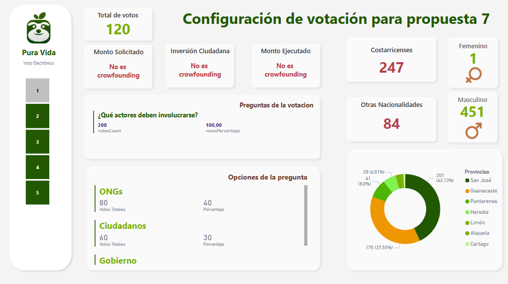

# 🎓 Caso #3 - 35%

### 🛠️ Temas Abordado:
El objetivo del proyecto es crear una plataforma de voto electrónico que sea accesible, segura y multifuncional. Esta herramienta permitirá a ciudadanos y organizaciones registrar propuestas de diversa índole, desde decisiones administrativas hasta proyectos municipales o reformas legales, y someterlas a votación de públicos específicos. Las votaciones serán parametrizables, con reglas claras y mecanismos de validación, alcanzando poblaciones segmentadas según diversos criterios como edad, ubicación, afiliación o profesión. Este sistema busca promover un entorno donde la voz ciudadana pueda incidir de manera ágil y directa en múltiples esferas.

El módulo de crowdfunding del sistema de voto electrónico tiene como objetivo impulsar la innovación y el emprendimiento en Costa Rica mediante un proceso participativo, transparente y digitalmente gobernado. Este módulo permite que ciudadanos y organizaciones presenten propuestas de proyectos con potencial empresarial, los cuales podrán ser evaluados y validados por entidades especializadas como aceleradoras, incubadoras o grupos de inversión. 

El Micitt debe presentar un prototipo de Voto Pura Vida a los poderes de la república enfocado en el caso de uso del crowdfunding para obtener el visto bueno con el que el proyecto irá avanzando.

---

## 👨‍🏫 Curso: Bases de Datos I  
**Ciclo:** I Semestre, 2025  
**Profesor:** Rodrigo Núñez  

---

## 👥 Estudiantes

| Nombre                     | Carné       |
|---------------------------|-------------|
|  Priscilla Romero Barquero | `2023332718` |
|  Carol Araya Conejo       | `2024089174` |
|  Daniel Sequeira Requenes | `2023282470` |
|  Carlos Abarca Mora       | `2024138701` |

---

## 📖 Indice

🌎 [Ir al Diseño de Base de Datos](#diseño-sql)

🌎 [Ir a Catálogo Base del sistema](#catalogo-base-del-sistema)

🌎 [Ir al Implementación del API](#implementación-del-api)

🌎 [Endpoints implementados por Stored Procedures](#endpoints-implementados-por-Stored-Procedures)

🌎 [Endpoints implementados por ORM](#endpoints-implementados-por-ORM)

🌎 [Ir al DashBoard de consulta](#dashboard-de-consulta)

---
## Diseño SQL
<details>
  <summary>Desplegar información</summary>

A continuación, se presenta el diseño físico de la base de datos, el cual ha sido implementado utilizando el motor de base de datos SQL Server, con el objetivo de garantizar la integridad, consistencia y seguridad de los datos. Esta elección permite conservar la información de forma estructurada y protegida, lo cual resulta fundamental dada la relevancia y sensibilidad de los datos gestionados en este sistema.

 📈[Diseño de la base de datos en SQL](./Diseño%20de%20la%20base%20de%20datos/Diagrama.pdf)

Por otro lado, se presenta el script de creación de la base de datos, con el cual se podrá generar la estructura completa del sistema, incluyendo tablas, relaciones, claves primarias y foráneas, así como restricciones necesarias para garantizar la integridad referencial y la organización lógica de los datos. Este script facilita la implementación del modelo en entornos de desarrollo, pruebas o producción.

🗄️[Script de creacion de la base de datos](./Diseño%20de%20la%20base%20de%20datos/scriptcreacion.sql)

  <details>
  <summary>Ver llenado de la base de datos</summary>

```sql
    
      colocarlo al final
```
</details>
</details>

---

## Catalogo Base del sistema
Este catálogo incluye, entre otros, datos sobre nacionalidades, provincias, niveles educativos, áreas profesionales, tipos de filtro, unidades de medida, zonas de impacto, estados de votación, y otros elementos que forman parte del modelo de datos general.

🔋[Ver llenado de la base de datos]()
 
### Configuración de propuestas
---

<details>
 <summary><b>vpv_proposalViewTypes</b></summary>
  
```sql
INSERT INTO [dbo].[vpv_proposalViewTypes] ([name], [enable])
VALUES
    ('Gráfica de barras', 1),
    ('Gráfica de líneas', 1),
    ('Comparativa anual', 1),
    ('Indicadores KPI', 1),
    ('Resumen ejecutivo', 1),
    ('Mapa de calor', 1),
    ('Tabla dinámica', 1)
```
</details>


  
<details>
 <summary><b>vpv_proposalTypes</b></summary>
  
```sql
INSERT INTO [dbo].[vpv_proposalTypes] ([name], [description], [enable])
VALUES
    ('Proyecto de ley', 'Propuesta para crear, modificar o derogar una ley vigente a través del proceso legislativo.', 1),
    ('Propuesta tecnológica', 'Iniciativa para implementar soluciones digitales o herramientas tecnológicas en instituciones o comunidades.', 1),
    ('Propuesta ambiental', 'Iniciativas enfocadas en la protección del medio ambiente, sostenibilidad o mitigación del cambio climático.', 1),
    ('Propuesta educativa', 'Proyectos dirigidos a mejorar el acceso, calidad o cobertura de la educación.', 1),
    ('Propuesta de salud pública', 'Acciones para fortalecer el sistema de salud, campañas preventivas o mejora de servicios médicos.', 1),
    ('Propuesta de infraestructura', 'Obras públicas como carreteras, puentes, edificios comunitarios o redes eléctricas.', 1),
    ('Propuesta social', 'Propuestas orientadas a mejorar la inclusión, equidad, y condiciones sociales de poblaciones vulnerables.', 1),
    ('Propuesta cultural', 'Proyectos para preservar, difundir o desarrollar el patrimonio y actividades culturales.', 1),
    ('Propuesta económica', 'Acciones dirigidas a estimular la economía local, emprendimientos o generación de empleo.', 1),
    ('Propuesta deportiva', 'Fomento de la actividad física, apoyo a ligas deportivas o construcción de instalaciones.', 1),
    ('Propuesta de seguridad', 'Medidas para prevenir el delito, mejorar la vigilancia o implementar tecnologías de seguridad.', 1),
    ('Propuesta participativa', 'Mecanismos que promuevan la participación ciudadana o procesos de gobernanza abierta.', 1),
    ('Propuesta piloto', 'Prueba controlada de nuevas ideas antes de su implementación general.', 1),
    ('Propuesta experimental', 'Iniciativas que exploran enfoques no convencionales o innovadores.', 1)INSERT INTO [dbo].[vpv_proposalTypes] ([name], [description], [enable])
VALUES
    ('Proyecto de ley', 'Propuesta para crear, modificar o derogar una ley vigente a través del proceso legislativo.', 1),
    ('Propuesta tecnológica', 'Iniciativa para implementar soluciones digitales o herramientas tecnológicas en instituciones o comunidades.', 1),
    ('Propuesta ambiental', 'Iniciativas enfocadas en la protección del medio ambiente, sostenibilidad o mitigación del cambio climático.', 1),
    ('Propuesta educativa', 'Proyectos dirigidos a mejorar el acceso, calidad o cobertura de la educación.', 1),
    ('Propuesta de salud pública', 'Acciones para fortalecer el sistema de salud, campañas preventivas o mejora de servicios médicos.', 1),
    ('Propuesta de infraestructura', 'Obras públicas como carreteras, puentes, edificios comunitarios o redes eléctricas.', 1),
    ('Propuesta social', 'Propuestas orientadas a mejorar la inclusión, equidad, y condiciones sociales de poblaciones vulnerables.', 1),
    ('Propuesta cultural', 'Proyectos para preservar, difundir o desarrollar el patrimonio y actividades culturales.', 1),
    ('Propuesta económica', 'Acciones dirigidas a estimular la economía local, emprendimientos o generación de empleo.', 1),
    ('Propuesta deportiva', 'Fomento de la actividad física, apoyo a ligas deportivas o construcción de instalaciones.', 1),
    ('Propuesta de seguridad', 'Medidas para prevenir el delito, mejorar la vigilancia o implementar tecnologías de seguridad.', 1),
    ('Propuesta participativa', 'Mecanismos que promuevan la participación ciudadana o procesos de gobernanza abierta.', 1),
    ('Propuesta piloto', 'Prueba controlada de nuevas ideas antes de su implementación general.', 1),
    ('Propuesta experimental', 'Iniciativas que exploran enfoques no convencionales o innovadores.', 1)
```
</details>

  


<details>
 <summary><b>vpv_processStatus</b></summary>
  
```sql
INSERT INTO [dbo].[vpv_processStatus] ([name])
VALUES
    ('Activo'),
    ('Inactivo'),
    ('En proceso'),
    ('Rechazado'),
    ('Aprobado'),
    ('Pendiente de revisión'),
    ('En validación'),
    ('Observado'),
    ('Completado'),
    ('Cancelado'),
    ('Archivado'),
    ('Publicado')
```
</details>

  
<details>
 <summary><b>vpv_governmentEntities</b></summary>
  
```sql
INSERT INTO [dbo].[vpv_governmentEntities] ([name], [acronym], [enable]) 
VALUES
    ('Caja Costarricense de Seguro Social', 'CCSS', 1),
    ('Ministerio de Educación Pública', 'MEP', 1),
    ('Ministerio de Hacienda', 'MH', 1),
    ('Instituto Costarricense de Electricidad', 'ICE', 1),
    ('Ministerio de Obras Públicas y Transportes', 'MOPT', 1),
    ('Ministerio de Salud', 'MS', 1),
    ('Instituto Nacional de Seguros', 'INS', 1),
    ('Instituto Costarricense de Turismo', 'ICT', 1),
    ('Tribunal Supremo de Elecciones', 'TSE', 1),
    ('Asamblea Legislativa', 'AL', 1),
    ('Universidad de Costa Rica', 'UCR', 1),
    ('Universidad Nacional', 'UNA', 1),
    ('Instituto Nacional de Aprendizaje', 'INA', 1),
    ('Ministerio de Justicia y Paz', 'MJP', 1),
    ('Ministerio de Ciencia, Innovación, Tecnología y Telecomunicaciones', 'MICITT', 1)

```
</details>


<details>
 <summary><b>vpv_governmentBenefits</b></summary>
  
```sql
INSERT INTO [dbo].[vpv_governmentBenefits] ([benefit], [enable], [dataType])
VALUES
    ('Incentivo económico de la CCSS', 1, 'decimal'),
    ('Subsidio mensual de vivienda', 1, 'decimal'),
    ('Tener al menos 10 empleados en el proyecto', 1, 'integer'),
    ('Número de adultos mayores beneficiados', 1, 'integer'),
    ('Acceso gratuito a servicios de salud primaria', 1, 'bit'),
    ('Participación en capacitaciones del INA', 1, 'bit'),
    ('Descuento en servicios eléctricos del ICE', 1, 'decimal'),
    ('Cantidad de estudiantes beneficiados por beca', 1, 'integer'),
    ('Disponibilidad de servicio de transporte', 1, 'bit'),
    ('Monto asignado por el MEP para materiales', 1, 'decimal'),
    ('Alquiler subsidiado por el IMAS', 1, 'decimal'),
    ('Participación en programa de salud preventiva', 1, 'bit'),
    ('Cantidad de computadoras entregadas', 1, 'integer'),
    ('Cobertura de seguro por el INS', 1, 'bit'),
    ('Reducción de tarifas municipales', 1, 'decimal')

```
</details>


<details>
 <summary><b>vpv_sponsornGroupTypes</b></summary>
  
```sql
INSERT INTO [dbo].[vpv_sponsornGroupTypes] ([name], [enable])
VALUES
    ('Incubadora de empresas', 1),
    ('Aceleradora de negocios', 1),
    ('Grupo de inversión', 1),
    ('Organización sin fines de lucro', 1),
    ('Agencia de desarrollo regional', 1),
    ('Banco de desarrollo', 1),
    ('Cámara empresarial', 1),
    ('Cooperativa de apoyo', 1),
    ('Organismo internacional', 1),
    ('Red de mentores', 1)
```
</details>


<details>
 <summary><b>vpv_sponsorGroups</b></summary>
  
```sql
INSERT INTO [dbo].[vpv_sponsorGroups] 
([name], [description], [enable], [deleted], [sponsorGroupTypeId])
VALUES
('ParqueTec', 'SponsorGroup', 1, 0, 1),        
('AUGE UCR', 'SponsorGroup', 1, 0, 2),         
('Carao Ventures', 'SponsorGroup', 1, 0, 3),   
('Parque La Libertad', 'SponsorGroup', 1, 0, 4),
('PROCOMER', 'SponsorGroup', 1, 0, 5),         
('GNPlus', 'SponsorGroup', 1, 0, 6),           
('Fundación CRUSA', 'SponsorGroup', 1, 0, 7),  
('InnovaAP', 'SponsorGroup', 1, 0, 8),         
('Impact Hub SJ', 'SponsorGroup', 1, 0, 9),    
('CONICIT', 'SponsorGroup', 1, 0, 10)
```
</details>


<details>
 <summary><b>vpv_sponsorAgrementsType</b></summary>
  
```sql
INSERT INTO [dbo].[vpv_sponsorAgrementsType] ([name], [description], [dataType])
VALUES
('Crowdfunding de donación', 'Aportes voluntarios sin retorno económico directo', 'bit'),
('Crowdfunding de recompensa', 'Aportes a cambio de un beneficio simbólico o material', 'bit'),
('Crowdfunding de préstamo', 'Financiamiento con obligación de reembolso con o sin intereses', 'decimal'),
('Crowdfunding de inversión', 'Participación a cambio de una parte del capital o utilidades', 'integer'),
('Apoyo con producto o servicio', 'El patrocinador entrega bienes o servicios en lugar de dinero', 'bit')
```
</details>

### Configuración General 
---

<details>
 <summary><b>vpv_schedules</b></summary>
  
```sql
CREATE OR ALTER PROCEDURE dbo.vpvSP_LlenarSchedules
AS
BEGIN
    DECLARE @horarios TABLE (
        name NVARCHAR(50),
        recurrencyType NVARCHAR(50),
        repetition INT
    );


    INSERT INTO @horarios (name, recurrencyType, repetition)
    VALUES 
        ('Cada semana', 'semanal', 1),
        ('Cada mes', 'mensual', 1),
        ('Cada 15 días', 'semanal', 2);

    DECLARE @i INT = 1;
    DECLARE @mes INT;
    DECLARE @dia INT;
    DECLARE @endDate DATETIME;


    WHILE @i <= 13
    BEGIN
        SET @mes = FLOOR(RAND(CHECKSUM(NEWID())) * 8) + 5;  
        SET @dia = FLOOR(RAND(CHECKSUM(NEWID())) * 30) + 1; 
        SET @endDate = DATEFROMPARTS(2025, @mes, @dia);

        INSERT INTO [dbo].[vpv_schedules] ([name], [recurrencyType], [repetition], [endType], [endDate])
        SELECT name, recurrencyType, repetition, 'NA', @endDate
        FROM @horarios;

        SET @i += 1;
    END
END;
GO


EXEC dbo.vpvSP_LlenarSchedules;
```
</details>


<details>
 <summary><b>vpv_transTypes</b></summary>
  
```sql
INSERT INTO [dbo].[vpv_transTypes] 
([name], [deleted], [transTypeId])
VALUES
    ( 'Credit', 0,1),            
    ( 'Debit', 0,2),              
    ( 'Refund', 0,3),           
    ( 'Manual Adjustment', 0, 4),  
    ( 'Chargeback', 0,5),            
    ( 'Deposit', 0,6),               
    ( 'Withdrawal', 0,7),            
    ( 'Transfer', 0,8)
```
</details>


<details>
 <summary><b>vpv_transSubTypes</b></summary>
  
```sql
INSERT INTO [dbo].[vpv_transSubTypes] ([name], [deleted])
VALUES
    ('Aporte voluntario', 0),
    ('Compra de recompensa', 0),
    ('Reembolso propuesta cancelada', 0),
    ('Aprobación de financiamiento', 0),
    ('Pago de propuesta', 0),
    ('Activación de beneficio', 0),
    ('Crédito institucional', 0),
    ('Cancelación de participación', 0),
    ('Inversión de Usuario', 0),
	('Inversión de Entidad', 0),
	('Inversión de Sponsor', 0),
	('Inversion a un plan',0)
```
</details>


<details>
 <summary><b>vpv_logSeverity</b></summary>
  
```sql
INSERT INTO [dbo].vpv_logSeverity([name])
VALUES
	('Low'),
	('Medium'),
	('High'),
	('Critical'),
	('Informational');
```
</details>


<details>
 <summary><b>vpv_logsSources</b></summary>
  
```sql
INSERT INTO [dbo].vpv_logsSources([name])
VALUES
	('System'),
	('Application'),
	('Database'),
	('Security'),
	('User Activity'),
	('Network'),
	('API'),
	('Payment Gateway'),
	('Error Handler'),
	('Authentication'),
	('File System');

```
</details>


<details>
 <summary><b>vpv_logTypes</b></summary>
  
```sql
INSERT INTO [dbo].vpv_logTypes([name])
VALUES
	('Error'),
	('Warning'),
	('Info'),
	('Debug'),
	('Critical'),
	('Audit'),
	('Security'),
	('Transaction'),
	('Performance'),
	('Access');

```
</details>


<details>
 <summary><b>vpv_currencies</b></summary>
  
```sql
INSERT INTO dbo.vpv_currencies(currencyId, name, acronym, symbol)--
VALUES (1, 'Colón Costa Rica', 'CRC', '¢'),(2, 'Dólar Estados Unidos', 'USD', '$');

```
</details>


<details>
 <summary><b>vpv_exchangeRates</b></summary>
  
```sql
INSERT INTO dbo.vpv_exchangeRates
	(startDate,    endDate,      exchangeRate, enable, currentExchange, currencyId)
VALUES
	  ('2025-06-14','2025-06-14', 0.00195,       1,      0,                   1),
	  ('2025-06-15','2025-06-15', 0.0019493,     1,      0,                   1),
	  ('2025-06-16','2025-06-16', 0.0019896,     1,      0,                   1),
	  ('2025-06-17','2025-06-17', 0.00199,       1,      0,                   1),
	  ('2025-06-18','2025-06-18', 0.00199,       1,      1,                   1);

```
</details>


<details>
 <summary><b>vpv_paymentMethods</b></summary>
  
```sql
INSERT INTO [dbo].[vpv_paymentMethods] ([name], [apiURL], [secretKey], [key], [enable])
VALUES
	('PayPal', 'https://api.paypal.com/v1/', 0x5A3D4C6F2A7B9C5F1234567890ABCDE1234567890ABCDEF0123456789ABCDEF, 0x7F5A9B6C5D7E1F23334567890ABCDE1234567890ABCDEF0123456789ABCDE, 1),
	('Stripe', 'https://api.stripe.com/v1/', 0x8F3A7B9C1D2E3F9A1234567890ABCDE1234567890ABCDEF0123456789ABCDE, 0x9B3D6C2F1D8E7A234567890ABCDE1234567890ABCDEF0123456789ABCDE, 1),
	('MercadoPago', 'https://api.mercadopago.com/v1/', 0x2D3A5F9B1C7E9D3A567890ABCDE1234567890ABCDEF0123456789ABCDE, 0x4F2A8D6E3B9F0A234567890ABCDE1234567890ABCDEF0123456789ABCDE, 1),
	('RappiPay', 'https://api.rappipay.com/v1/', 0x1A3D4E5F2B8C9D3A567890ABCDE1234567890ABCDEF0123456789ABCDE, 0x5E7A9D2B6C3F4A1234567890ABCDE1234567890ABCDEF0123456789ABCDE, 1),
	('Apple Pay', 'https://api.apple.com/v1/', 0x0B5D6F3A2C8E9D234567890ABCDE1234567890ABCDEF0123456789ABCDE, 0x9C7F2A3D8B5E1F9A234567890ABCDE1234567890ABCDEF0123456789ABCDE, 1);

```
</details>


<details>
 <summary><b>vpv_availablePaymentMethods</b></summary>
  
```sql
CREATE OR ALTER PROCEDURE dbo.vpvSP_InsertarPaymentMethods
AS
BEGIN
    DECLARE @i INT = 1;
    DECLARE @name VARCHAR(55);
    DECLARE @methodId INT;
    DECLARE @token VARCHAR(256);
    DECLARE @expTokenDate DATETIME;
    DECLARE @maskAccount NVARCHAR(MAX);
    DECLARE @callbackURL NVARCHAR(200);
    DECLARE @configurationDetails NVARCHAR(MAX);
    DECLARE @refreshToken VARBINARY(256);

	-- Cursor para recorrer los métodos de pago existentes, recibiendo loda daros de la consulta select de la tabla que contiene los metodos de pago
    DECLARE method_cursor CURSOR FOR
        SELECT [name], [methodId]
        FROM [dbo].[vpv_paymentMethods]; 

    OPEN method_cursor;
    FETCH NEXT FROM method_cursor INTO @name, @methodId;

    WHILE @i <= 15
    BEGIN
        SET @token = CONVERT(VARCHAR(256), NEWID());
        SET @expTokenDate = DATEADD(DAY, @i * 30, GETDATE());
        SET @maskAccount = CONCAT('****', RIGHT('000' + CAST((1000 + @i * 7) AS NVARCHAR), 4));
        SET @callbackURL = CONCAT('https://vpv.example.com/callback/method', @i);
        SET @configurationDetails = CONCAT('{"currency":"USD", "method":"', @name, '"}');
        SET @refreshToken = CAST(HASHBYTES('SHA2_256', @token) AS VARBINARY(256));

        INSERT INTO [dbo].[vpv_availablePaymentMethods]
           ([name], [token], [expTokenDate], [maskAccount], [callbackURL], [configurationDetails], [refreshToken], [methodId])
        VALUES
           (@name, @token, @expTokenDate, @maskAccount, @callbackURL, @configurationDetails, @refreshToken, @methodId);

        SET @i += 1;

        FETCH NEXT FROM method_cursor INTO @name, @methodId;

        IF @@FETCH_STATUS <> 0
        BEGIN
            CLOSE method_cursor;
            OPEN method_cursor;
            FETCH NEXT FROM method_cursor INTO @name, @methodId;
        END
    END

	-- Cerrar y liberar el cursor
    CLOSE method_cursor;
    DEALLOCATE method_cursor;
END;
GO


EXEC dbo.vpvSP_InsertarPaymentMethods;

```
</details>


<details>
 <summary><b>vpv_founds</b></summary>
  
```sql
INSERT INTO [dbo].[vpv_founds]
    ([name])
VALUES ('Dinero');
```
</details>


### Configuracion de Roles y Permisos


<details>
<summary><b>vpv_PermissionResource</b></summary>

```sql
INSERT INTO [dbo].[vpv_PermissionResource] (
    id_permissionResource,
    name,
    creationDate,
    updatedAt,
    enabled,
    deleted
)
SELECT
    ROW_NUMBER() OVER (ORDER BY t.name) + ISNULL((
        SELECT MAX(id_permissionResource) FROM [dbo].[vpv_PermissionResource]
    ), 0) AS id_permissionResource,
    t.name AS name,
    GETDATE() AS creationDate,
    GETDATE() AS updatedAt,
    1 AS enabled,   -- Habilitado por defecto
    0 AS deleted    -- No eliminado por defecto
FROM sys.tables t;
``` 
</details>


<details>
<summary><b>vpv_PermissionAction</b></summary>

```sql
INSERT INTO [dbo].[vpv_PermissionAction] (
    id_permissionAction,
    name,
    descripcion
)
VALUES
    (1, 'SELECT', 'Permite consultar datos de una tabla'),
    (2, 'INSERT', 'Permite insertar nuevos registros en una tabla'),
    (3, 'UPDATE', 'Permite modificar registros existentes en una tabla'),
    (4, 'DELETE', 'Permite eliminar registros de una tabla');
``` 
</details>


<details>
<summary><b>vpv_Permissions</b></summary>

```sql
INSERT INTO [dbo].[vpv_Permissions] (
    id_permission,
    id_permisionResource,
    id_permissionAction,
    descripcion,
    creationDate,
    updatedAt,
    enabled,
    deleted,
    checksum
)
SELECT
    ROW_NUMBER() OVER (ORDER BY r.id_permissionResource, a.id_permissionAction) +
        ISNULL((SELECT MAX(id_permission) FROM [dbo].[vpv_Permissions]), 0) AS id_permission,
    r.id_permissionResource,
    a.id_permissionAction,
    CONCAT('Permiso para ', a.name, ' en ', r.name) AS descripcion,
    GETDATE() AS creationDate,
    GETDATE() AS updatedAt,
    1 AS enabled,
    0 AS deleted,
    -- Ejemplo básico de checksum: puedes usar una función HASH real como HASHBYTES si lo deseas
    CONCAT(r.id_permissionResource, '-', a.id_permissionAction) AS checksum
FROM [dbo].[vpv_PermissionResource] r
CROSS JOIN [dbo].[vpv_PermissionAction] a;

``` 
</details>


<details>
<summary><b>vpv_Roles</b></summary>

```sql
DECLARE @now DATETIME = GETDATE();
INSERT INTO dbo.vpv_Roles
  ([id_role], [name], [descripcion], [creationDate], [updateAt], [enabled], [deleted], [checksum])
VALUES
  (1,  'Ciudadano',
       'Usuario registrado que puede votar y consultar propuestas.',
       @now, @now, 1, 0,
       HASHBYTES(
         'SHA2_256',
         CONCAT(
           '1','Ciudadano','Usuario registrado que puede votar y consultar propuestas.',
           CONVERT(VARCHAR(126), @now, 126),
           CONVERT(VARCHAR(126), @now, 126),
           '1','0'
         )
       )
  ),
  (2,  'RepresentanteOrg',
       'Usuario que representa a una organización y presenta propuestas.',
       @now, @now, 1, 0,
       HASHBYTES(
         'SHA2_256',
         CONCAT(
           '2','RepresentanteOrg','Usuario que representa a una organización y presenta propuestas.',
           CONVERT(VARCHAR(126), @now, 126),
           CONVERT(VARCHAR(126), @now, 126),
           '1','0'
         )
       )
  ),
  (3,  'Proponente',
       'Usuario que crea y gestiona propuestas de votación.',
       @now, @now, 1, 0,
       HASHBYTES(
         'SHA2_256',
         CONCAT(
           '3','Proponente','Usuario que crea y gestiona propuestas de votación.',
           CONVERT(VARCHAR(126), @now, 126),
           CONVERT(VARCHAR(126), @now, 126),
           '1','0'
         )
       )
  ),
  (4,  'ValidadorHumano',
       'Revisor que valida propuestas con firmas privadas.',
       @now, @now, 1, 0,
       HASHBYTES(
         'SHA2_256',
         CONCAT(
           '4','ValidadorHumano','Revisor que valida propuestas con firmas privadas.',
           CONVERT(VARCHAR(126), @now, 126),
           CONVERT(VARCHAR(126), @now, 126),
           '1','0'
         )
       )
  ),
  (5,  'AceleradoraInversor',
       'Entidad que avala y financia propuestas de crowdfunding.',
       @now, @now, 1, 0,
       HASHBYTES(
         'SHA2_256',
         CONCAT(
           '5','AceleradoraInversor','Entidad que avala y financia propuestas de crowdfunding.',
           CONVERT(VARCHAR(126), @now, 126),
           CONVERT(VARCHAR(126), @now, 126),
           '1','0'
         )
       )
  ),
  (6,  'FuncionarioGubernamental',
       'Representante del Gobierno que aprueba políticas y beneficios.',
       @now, @now, 1, 0,
       HASHBYTES(
         'SHA2_256',
         CONCAT(
           '6','FuncionarioGubernamental','Representante del Gobierno que aprueba políticas y beneficios.',
           CONVERT(VARCHAR(126), @now, 126),
           CONVERT(VARCHAR(126), @now, 126),
           '1','0'
         )
       )
  ),
  (7,  'Auditor',
       'Accede a logs.',
       @now, @now, 1, 0,
       HASHBYTES(
         'SHA2_256',
         CONCAT(
           '8','Auditor','Accede a logs.',
           CONVERT(VARCHAR(126), @now, 126),
           CONVERT(VARCHAR(126), @now, 126),
           '1','0'
         )
       )
  ),
  (8,  'SuperAuditor',
       'Accede a la informacion de log, propuestas, crowdfunding y votaciones.',
       @now, @now, 1, 0,
       HASHBYTES(
         'SHA2_256',
         CONCAT(
           '8','SuperAuditor','Accede a la informacion de log, propuestas, crowdfunding y votaciones.',
           CONVERT(VARCHAR(126), @now, 126),
           CONVERT(VARCHAR(126), @now, 126),
           '1','0'
         )
       )
  );
GO
``` 
</details>

<details>
<summary><b>Rol de Ciudadano</b></summary>

```sql
EXEC dbo.vpvSP_BatchAgregarPermisoRol
    @roleName     = 'Ciudadano',
    @actionName   = 'SELECT',
    @resourceList = 'vpv_balances,vpv_currencies,vpv_exchangeRates,vpv_founds,vpv_investmentPayment,vpv_investorsPerProject,vpv_investorsReturns,vpv_paymentMethods,vpv_payments,vpv_planBalance,vpv_transactionPerPlan,vpv_transactionPerUser,vpv_transactions,vpv_userBalance';

EXEC dbo.vpvSP_BatchAgregarPermisoRol
    @roleName     = 'Ciudadano',
    @actionName   = 'INSERT',
    @resourceList = 'vpv_balances,vpv_currencies,vpv_exchangeRates,vpv_founds,vpv_investmentPayment,vpv_investorsPerProject,vpv_investorsReturns,vpv_paymentMethods,vpv_payments,vpv_planBalance,vpv_transactionPerPlan,vpv_transactionPerUser,vpv_transactions,vpv_userBalance';

EXEC dbo.vpvSP_BatchAgregarPermisoRol
    @roleName     = 'Ciudadano',
    @actionName   = 'UPDATE',
    @resourceList = 'vpv_balances,vpv_founds,vpv_paymentMethods,vpv_userBalance';


EXEC dbo.vpvSP_BatchAgregarPermisoRol
    @roleName     = 'Ciudadano',
    @actionName   = 'SELECT',
    @resourceList = 'vpv_AllowedVoters,vpv_EndOfVoting,vpv_OptionsQuestion,vpv_PlansVotes,vpv_statusVoting,vpv_TargetPopulations,vpv_TargetPopulationsVoting,vpv_VoteComment,vpv_Voter,vpv_VoterDemographics,vpv_VoterResidence,vpv_Votes,vpv_VotesTaken,vpv_voteValues,vpv_votingConfigurations,vpv_votingQuestions,vpv_votingReasons,vpv_votingRestrictions,vpv_votingRestrictionTypes,vpv_VotingRules,vpv_VotingRuleSubType,vpv_VotingRuleTypes,vpv_votingTypes';

EXEC dbo.vpvSP_BatchAgregarPermisoRol
    @roleName     = 'Ciudadano',
    @actionName   = 'INSERT',
    @resourceList = 'vpv_GeneralResultsPerQuestion,vpv_ResultsPerFilter,vpv_ResultsPerOption,vpv_VoteComment,vpv_Voter,vpv_VoterDemographics,vpv_VoterResidence,vpv_Votes,vpv_VotesTaken,vpv_voteValues,vpv_VotingResultsSummary';

EXEC dbo.vpvSP_BatchAgregarPermisoRol
    @roleName     = 'Ciudadano',
    @actionName   = 'UPDATE',
    @resourceList = 'vpv_GeneralResultsPerQuestion,vpv_ResultsPerFilter,vpv_ResultsPerOption,vpv_VoteComment,vpv_Voter,vpv_VoterDemographics,vpv_VoterResidence,vpv_Votes,vpv_VotesTaken,vpv_voteValues,vpv_VotingResultsSummary';


EXEC dbo.vpvSP_BatchAgregarPermisoRol
    @roleName     = 'Ciudadano',
    @actionName   = 'UPDATE',
    @resourceList = 'vpv_authmethods,vpv_availablePaymentMethods,vpv_availablePaymentMethodsPerUser,vpv_biometricauths,vpv_biorequests,vpv_bioresponses,vpv_biostatus,vpv_biotypes,vpv_devices,vpv_devicetypes,vpv_docs,vpv_docincidents,vpv_docinfos,vpv_docstates,vpv_docstypes,vpv_identitydocs,vpv_identitystates,vpv_identitytype,vpv_languages,vpv_mfa,vpv_mfachallenges,vpv_mfamethods,vpv_mfaselect,vpv_mfasettings,vpv_nationality,vpv_notificationMethods,vpv_requests,vpv_requeststates,vpv_RequestStatus,vpv_requestvalidators,vpv_useroptions,vpv_userperrole,vpv_userResidence,vpv_UserRole,vpv_Users,vpv_validations,vpv_validationstatus,vpv_ips,vpv_keyowners,vpv_SearchingTags';


EXEC dbo.vpvSP_BatchAgregarPermisoRol
    @roleName     = 'Ciudadano',
    @actionName   = 'INSERT',
    @resourceList = 'vpv_logs,vpv_logSeverity,vpv_logsSources,vpv_logTypes';
``` 
</details>

<details>
<summary><b>Rol de FuncionarioGubernamental</b></summary>

```sql
EXEC dbo.vpvSP_BatchAgregarPermisoRol
    @roleName     = 'FuncionarioGubernamental',
    @actionName   = 'SELECT',
    @resourceList = 'vpv_governmentBenefits,vpv_governmentConditions,vpv_governmentEntities,vpv_PermissionAction,vpv_PermissionResource,vpv_Permissions,vpv_RolePermission,vpv_Roles,vpv_whitelistips,vpv_whitelists';

EXEC dbo.vpvSP_BatchAgregarPermisoRol
    @roleName     = 'FuncionarioGubernamental',
    @actionName   = 'INSERT',
    @resourceList = 'vpv_governmentBenefits,vpv_governmentConditions,vpv_governmentEntities,vpv_whitelistips,vpv_whitelists';

EXEC dbo.vpvSP_BatchAgregarPermisoRol
    @roleName     = 'FuncionarioGubernamental',
    @actionName   = 'UPDATE',
    @resourceList = 'vpv_governmentBenefits,vpv_governmentConditions,vpv_governmentEntities,vpv_whitelistips,vpv_whitelists';

``` 
</details>

<details>
<summary><b>Rol de Proponente</b></summary>

```sql
EXEC dbo.vpvSP_BatchAgregarPermisoRol
    @roleName     = 'Proponente',
    @actionName   = 'SELECT',
    @resourceList = 'vpv_crowdfoundingProposals,vpv_FilesPerProposal,vpv_proposalBalance,vpv_proposalComments,vpv_proposalNormalViews,vpv_proposalRequirements,vpv_proposals,vpv_proposalTypes,vpv_proposalVersions,vpv_proposalViews,vpv_proposalViewTypes,vpv_projectReports,vpv_AllowedVoters,vpv_EndOfVoting,vpv_GeneralResultsPerQuestion,vpv_OptionsQuestion,vpv_PlansVotes,vpv_ResultsPerFilter,vpv_ResultsPerOption,vpv_ResultTypes,vpv_statusVoting,vpv_TargetPopulations,vpv_TargetPopulationsVoting,vpv_VoteComment,vpv_votingConfigurations,vpv_votingQuestions,vpv_votingReasons,vpv_votingRestrictions,vpv_votingRestrictionTypes,vpv_VotingResultsSummary,vpv_VotingResultStatus,vpv_VotingRules,vpv_VotingRuleSubType,vpv_VotingRuleTypes,vpv_votingTypes';

EXEC dbo.vpvSP_BatchAgregarPermisoRol
    @roleName     = 'Proponente',
    @actionName   = 'INSERT',
    @resourceList = 'vpv_crowdfoundingProposals,vpv_FilesPerProposal,vpv_proposalBalance,vpv_proposalComments,vpv_proposalNormalViews,vpv_proposalRequirements,vpv_proposals,vpv_proposalTypes,vpv_proposalVersions,vpv_proposalViews,vpv_proposalViewTypes,vpv_projectReports,vpv_AllowedVoters,vpv_EndOfVoting,vpv_GeneralResultsPerQuestion,vpv_OptionsQuestion,vpv_PlansVotes,vpv_ResultsPerFilter,vpv_ResultsPerOption,vpv_ResultTypes,vpv_statusVoting,vpv_TargetPopulations,vpv_TargetPopulationsVoting,vpv_VoteComment,vpv_votingConfigurations,vpv_votingQuestions,vpv_votingReasons,vpv_votingRestrictions,vpv_votingRestrictionTypes,vpv_VotingResultsSummary,vpv_VotingResultStatus,vpv_VotingRules,vpv_VotingRuleSubType,vpv_VotingRuleTypes,vpv_votingTypes';

EXEC dbo.vpvSP_BatchAgregarPermisoRol
    @roleName     = 'Proponente',
    @actionName   = 'UPDATE',
    @resourceList = 'vpv_crowdfoundingProposals,vpv_FilesPerProposal,vpv_proposalBalance,vpv_proposalComments,vpv_proposalNormalViews,vpv_proposalRequirements,vpv_proposals,vpv_proposalTypes,vpv_proposalVersions,vpv_proposalViews,vpv_proposalViewTypes,vpv_projectReports,vpv_AllowedVoters,vpv_EndOfVoting,vpv_GeneralResultsPerQuestion,vpv_OptionsQuestion,vpv_PlansVotes,vpv_ResultsPerFilter,vpv_ResultsPerOption,vpv_ResultTypes,vpv_statusVoting,vpv_TargetPopulations,vpv_TargetPopulationsVoting,vpv_VoteComment,vpv_votingConfigurations,vpv_votingQuestions,vpv_votingReasons,vpv_votingRestrictions,vpv_votingRestrictionTypes,vpv_VotingResultsSummary,vpv_VotingResultStatus,vpv_VotingRules,vpv_VotingRuleSubType,vpv_VotingRuleTypes,vpv_votingTypes';

``` 
</details>

<details>
<summary><b>Rol de RepresentanteOrg</b></summary>

```sql
EXEC dbo.vpvSP_BatchAgregarPermisoRol
    @roleName     = 'RepresentanteOrg',
    @actionName   = 'SELECT',
    @resourceList = 'vpv_entities,vpv_entitiestatus,vpv_entityBalance,vpv_entitydescription,vpv_entitykey,vpv_entityroles,vpv_entityroletypes,vpv_entitysubtypes,vpv_entitytypes,vpv_availablePaymentMethodPerEntity';

EXEC dbo.vpvSP_BatchAgregarPermisoRol
    @roleName     = 'RepresentanteOrg',
    @actionName   = 'INSERT',
    @resourceList = 'vpv_entities,vpv_entitiestatus,vpv_entityBalance,vpv_entitydescription,vpv_entitykey,vpv_entityroles,vpv_entityroletypes,vpv_entitysubtypes,vpv_entitytypes,vpv_availablePaymentMethodPerEntity';

EXEC dbo.vpvSP_BatchAgregarPermisoRol
    @roleName     = 'RepresentanteOrg',
    @actionName   = 'UPDATE',
    @resourceList = 'vpv_entities,vpv_entitiestatus,vpv_entityBalance,vpv_entitydescription,vpv_entitykey,vpv_entityroles,vpv_entityroletypes,vpv_entitysubtypes,vpv_entitytypes,vpv_availablePaymentMethodPerEntity';

``` 
</details>

<details>
<summary><b>Rol de Auditor</b></summary>

```sql
EXEC dbo.vpvSP_BatchAgregarPermisoRol
    @roleName     = 'Auditor',
    @actionName   = 'SELECT',
    @resourceList = 'vpv_logs,vpv_logSeverity,vpv_logsSources,vpv_logTypes';

``` 
</details>


### Configuracion de la votacion

---
<details>
<summary><b>vpv_TargetPopulations</b></summary>

```sql
-- Inserciones para la tabla vpv_TargetPopulations
INSERT INTO [dbo].[vpv_TargetPopulations]
           ([name], [description], [creationDate], [enable], [checksum])
VALUES
-- Población joven adulta
('Jóvenes Adultos',
 'Personas entre 18 y 35 años, consideradas jóvenes adultos para fines de segmentación demográfica y programas sociales.',
 GETDATE(), 1, 'chk_pop_001'),

-- Población adulta mayor
('Adultos Mayores',
 'Ciudadanos mayores de 65 años que forman parte de programas de apoyo y bienestar.',
 GETDATE(), 1, 'chk_pop_002'),

-- Población con discapacidad
('Personas con Discapacidad',
 'Individuos con alguna condición de discapacidad reconocida, física, sensorial o cognitiva.',
 GETDATE(), 1, 'chk_pop_003'),

-- Estudiantes universitarios
('Estudiantes Universitarios',
 'Personas activas en instituciones de educación superior a nivel universitario.',
 GETDATE(), 1, 'chk_pop_004'),

-- Población migrante
('Población Migrante',
 'Personas con estatus de residencia temporal o permanente, incluyendo refugiados.',
 GETDATE(), 1, 'chk_pop_005');
```
</details>

<details>
<summary><b>vpv_FilterTypes</b></summary>

```sql
-- FilterTypes para cada tipo de demografía
INSERT INTO [dbo].[vpv_FilterTypes]
           ([name], [enable], [datatype], [referenceId], [reference], [demotypeid], [demosubtypeid], [checksum])
VALUES
-- Sexo
('Sexo', 1, 'string', NULL, 0, 1, NULL, 'abc123'),

-- Nacionalidad
('Nacionalidad', 1, 'string', NULL, 0, 2, NULL, 'def456'),

-- Provincia
('Provincia', 1, 'string', NULL, 0, 3, NULL, 'ghi789'),

-- Condición migratoria
('Condición migratoria', 1, 'string', NULL, 0, 4, NULL, 'jkl012'),

-- Nivel educativo
('Nivel educativo', 1, 'string', NULL, 0, 5, NULL, 'mno345'),

-- Área profesional
('Área profesional', 1, 'string', NULL, 0, 6, NULL, 'pqr678'),

-- Sector laboral
('Sector laboral', 1, 'string', NULL, 0, 7, NULL, 'stu901'),

-- Situación económica
('Situación económica', 1, 'string', NULL, 0, 8, NULL, 'vwx234'),

-- Idioma principal
('Idioma principal', 1, 'string', NULL, 0, 9, NULL, 'yz0123'),

-- Grupo étnico
('Grupo étnico', 1, 'string', NULL, 0, 10, NULL, 'abc456'),

-- Zona geográfica
('Zona geográfica', 1, 'string', NULL, 0, 11, NULL, 'def789'),

-- Discapacidad
('Discapacidad', 1, 'string', NULL, 0, 12, NULL, 'ghi012'),

-- Religión
('Religión', 1, 'string', NULL, 0, 13, NULL, 'jkl345');
```
</details>

<details>
<summary><b>vpv_PopulationFilters</b></summary>

```sql
-- vpv_PopulationFilters

-- Filtros para Jóvenes Adultos (edad entre 18 y 35)
INSERT INTO [dbo].[vpv_PopulationFilters]
           ([description], [idFilterType], [valueMin], [valueMax], [referenceValue], [validation], [enable], [creationDate], [checksum], [idTargetPopulation])
VALUES 
           ('Edad 18-35', 1, 18.00, 35.00, NULL, 1, 1, GETDATE(), 'chk_fil_001', 1);

-- Filtros para Adultos Mayores (edad > 65)
INSERT INTO [dbo].[vpv_PopulationFilters]
           ([description], [idFilterType], [valueMin], [valueMax], [referenceValue], [validation], [enable], [creationDate], [checksum], [idTargetPopulation])
VALUES 
           ('Edad 65+', 1, 65.00, 120.00, NULL, 1, 1, GETDATE(), 'chk_fil_002', 2);

-- Filtros para Personas con Discapacidad (subtipo "Discapacidad" distinto de "Ninguna")
INSERT INTO [dbo].[vpv_PopulationFilters]
           ([description], [idFilterType], [valueMin], [valueMax], [referenceValue], [validation], [enable], [creationDate], [checksum], [idTargetPopulation])
VALUES 
           ('Tiene discapacidad', 13, NULL, NULL, 2, 1, 1, GETDATE(), 'chk_fil_003', 3);  -- Ej: referencia al id de "Física" en demosubtype

-- Filtros para Estudiantes Universitarios (nivel educativo = "Universitario")
INSERT INTO [dbo].[vpv_PopulationFilters]
           ([description], [idFilterType], [valueMin], [valueMax], [referenceValue], [validation], [enable], [creationDate], [checksum], [idTargetPopulation])
VALUES 
           ('Nivel universitario', 5, NULL, NULL, 5, 1, 1, GETDATE(), 'chk_fil_004', 4);  -- referencia al id del subtipo "Universitario"

-- Filtros para Población Migrante (condición migratoria ≠ "Nacional")
INSERT INTO [dbo].[vpv_PopulationFilters]
           ([description], [idFilterType], [valueMin], [valueMax], [referenceValue], [validation], [enable], [creationDate], [checksum], [idTargetPopulation])
VALUES 
           ('Es migrante', 4, NULL, NULL, 2, 1, 1, GETDATE(), 'chk_fil_005', 5);  -- Ej: referencia a "Residente permanente"
```
</details>

<details>
<summary><b>vpv_SearchingTags</b></summary>

```sql
-- Searching Tags

-- Tag para Jóvenes Adultos
INSERT INTO [dbo].[vpv_SearchingTags]
           ([name], [idTargetPopulations], [enable])
VALUES     (N'JOVEN', 1, 1);

-- Tag para Adultos Mayores
INSERT INTO [dbo].[vpv_SearchingTags]
           ([name], [idTargetPopulations], [enable])
VALUES     (N'MAYOR', 2, 1);

-- Tag para Personas con Discapacidad
INSERT INTO [dbo].[vpv_SearchingTags]
           ([name], [idTargetPopulations], [enable])
VALUES     (N'DISCAP', 3, 1);

-- Tag para Estudiantes Universitarios
INSERT INTO [dbo].[vpv_SearchingTags]
           ([name], [idTargetPopulations], [enable])
VALUES     (N'UNIV', 4, 1);

-- Tag para Población Migrante
INSERT INTO [dbo].[vpv_SearchingTags]
           ([name], [idTargetPopulations], [enable])
VALUES     (N'MIGRANT', 5, 1);
```
</details>

<details>
<summary><b>vpv_UnitMeasure</b></summary>

```sql
-- Unit Measure
INSERT INTO [dbo].[vpv_UnitMeasure]([name],[datatype],[enable])
     VALUES
           ('Litros','decimal(5,2)',1),
           ('Semanas','decimal(5,2)',1),
           ('Provincia','int',1),
           ('Personas','int',1),
           ('Votaciones','int',1),
           ('Cantidad','int',1),
           ('Porcentaje','decimal(5,2)',1);
```
</details>

<details>
<summary><b>vpv_ImpactZoneTypes</b></summary>

```sql
-- Impact Zone Types
INSERT INTO [dbo].[vpv_ImpactZoneTypes] ([name], [idUnitMeasure], [enable], [checksum])
VALUES
    ('Uso de agua potable', 1, 1, N'abc123    '),  -- idUnitMeasure = Litros
    ('Duración de proyecto', 2, 1, N'def456    '), -- idUnitMeasure = Semanas
    ('Cobertura territorial', 3, 1, N'ghi789    '),-- idUnitMeasure = Provincia
    ('Personas beneficiadas', 4, 1, N'xyz321    ');-- idUnitMeasure = Personas
```
</details>

<details>
<summary><b>vpv_ClosureTypes</b></summary>

```sql
-- Closure Types
INSERT INTO [dbo].[vpv_ClosureTypes]
           ([name],[enable])
     VALUES
           ('Cierre hasta que los votantes terminen',1),
           ('Cierre hasta la fecha',1);
```
</details>

<details>
<summary><b>vpv_VotingRuleSubType</b></summary>

```sql
-- Voting Rule Sub Type
INSERT INTO [dbo].[vpv_VotingRuleSubType]
           ([name],[idUnitMeasure],[enable])
     VALUES
           ('Minimo de votacion', 5,1),
           ('Porcentaje de votacion', 6,1),
           ('Organizaciones', 7,1),
           ('Personas', 7,1);
```
</details>

<details>
<summary><b>vpv_VotingRuleTypes</b></summary>

```sql
-- vpv_VotingRuleTypes
INSERT INTO [dbo].[vpv_VotingRuleTypes]
           ([name],[enable])
     VALUES
           ('Visibilidad',1),
           ('Aceptacion',1),
           ('Rechazo',1),
           ('Calificacion',1);
```
</details>

<details>
<summary><b>vpv_statusVoting</b></summary>

```sql
-- vpv_statusVoting
INSERT INTO [dbo].[vpv_statusVoting]
           ([name], [enable], [checksum])
     VALUES
           ('Abierta', 1, N'8efb9d10c2'),
           ('En curso', 1, N'2a6370a34e'),
           ('Finalizada', 1, N'bb27a94cfc');
```
</details>

## Implementación del API
<details>
  <summary>Desplegar información</summary>

  Implementación del API Serverless para el Sistema de Voto Electrónico y Crowdfunding

Introducción

Para la implementación del API del sistema de voto electrónico y crowdfunding, se ha decidido utilizar un service serverless que se desarrollará en Python, aprovechando la integración con Azure Functions. Aunque el modelo serverless es típicamente para la nube, en este caso el despliegue será completamente local para garantizar que todos los miembros del equipo trabajen con la misma implementación y tengan acceso uniforme a la base de datos local.

Esta estrategia aporta varias ventajas importantes:

- Consistencia: Todos los desarrolladores usan el mismo entorno local, evitando diferencias entre máquinas.
- Colaboración distribuida: Facilita el trabajo en equipo sin necesidad de conexión constante a la nube.
- Portabilidad: Se puede trasladar fácilmente el entorno a cualquier computadora sin cambios en la configuración.
- Preparación para despliegue en la nube: La arquitectura serverless mantiene la compatibilidad para futuras migraciones a Azure esto por medio de la herramienta de tipo extension que VSCODE brinda para que sea sencillo el despliegue.

Arquitectura y tecnología elegida

Azure Functions

- Se usa Azure Functions Core Tools para correr el servicio localmente, simulando un entorno serverless.
- Las funciones serán el punto de entrada para las solicitudes API.
- El runtime maneja automáticamente la asignación y liberación de recursos, así como el escalado si fuera necesario.
- Se prueban y desarrollan las funciones en Visual Studio Code con la extensión de Azure Functions, permitiendo depuración y pruebas sencillas.

Lenguaje de programación: Python

- Python es ampliamente usado y soportado en Azure Functions.
- Permite integración sencilla con bases de datos usando bibliotecas estándar.
- Facilita la integración con posibles servicios de inteligencia artificial o análisis avanzado.

Implementación del acceso a base de datos

El API se divide en dos categorías para interactuar con la base de datos, ambas con enfoque en eficiencia, mantenibilidad y buenas prácticas de desarrollo:

1. Procedimientos almacenados (Stored Procedures - SP)

- Los procedimientos almacenados son bloques de código SQL predefinido que se ejecutan dentro del motor de base de datos.
- Permiten encapsular lógica compleja, validaciones, y transacciones dentro de la base de datos.
- En la implementación serverless, las funciones Azure invocarán estos procedimientos a través de la biblioteca pyodbc, que ofrece conexión y ejecución de consultas SQL en bases de datos Microsoft SQL Server.
- Ventajas:
  - Mejor rendimiento por ejecución directa en la base de datos.
  - Centralización de la lógica de negocio en la base de datos.
  - Mejor manejo transaccional y control de errores dentro del motor.
- Desventajas:
  - Menos flexible para cambios frecuentes en lógica de negocio.
  - Más dependiente del motor de base de datos específico.

2. ORM (Object-Relational Mapping) con SQLAlchemy

- SQLAlchemy es una biblioteca ORM que permite mapear tablas y relaciones SQL a clases y objetos en Python.
- Facilita la creación y manipulación de datos mediante objetos, haciendo el código más legible y mantenible.
- Con SQLAlchemy se pueden definir modelos (clases) que representan las tablas, y luego realizar consultas y operaciones sobre esos modelos sin escribir SQL explícito.
- Ventajas:
  - Mayor flexibilidad y rapidez para cambios en la lógica de negocio.
  - Independencia relativa del motor de base de datos (se puede cambiar fácilmente).
  - Mejor integración con código Python y uso de patrones de diseño.
- Desventajas:
  - Puede tener un ligero impacto en rendimiento respecto a SP.
  - Requiere aprendizaje y definición adecuada de los modelos.

Flujo general para los endpoints API

Cada endpoint en el API serverless seguirá los siguientes pasos clave:

1. Recepción de la petición: la función Azure recibe la solicitud HTTP con los parámetros necesarios.
2. Validaciones iniciales: se verifican credenciales, formato de datos y autorizaciones.
3. Ejecución de la lógica:
   - Si es un endpoint basado en SP, se conecta a la base de datos y ejecuta el procedimiento almacenado correspondiente con los parámetros recibidos.
   - Si es un endpoint basado en ORM, se utiliza SQLAlchemy para manipular los modelos y realizar las consultas o actualizaciones necesarias.
4. Control transaccional: se asegura que las operaciones críticas (como registro de votos) sean atómicas y consistentes.
5. Respuesta: se formatea y envía la respuesta al cliente, con la información solicitada o confirmación de la operación.

Instalación y configuración

Para trabajar con este sistema localmente, se deben instalar las siguientes herramientas y librerías:

- Azure Functions Core Tools: para correr y probar localmente las funciones serverless.

npm install -g azure-functions-core-tools@4

- Extensión Azure Functions en Visual Studio Code: facilita desarrollo y pruebas.

- Python y librerías necesarias: en el entorno virtual o global de Python instalar:

pip install azure-functions pyodbc sqlalchemy

- Herramientas para probar API: como Postman o Thunder Client (extensión VS Code).

### Estructura del Proyecto Azure API

<details>
  <summary>Desplegar información</summary>

Este proyecto implementa un API serverless con Azure Functions en Python para el sistema de voto electrónico y crowdfunding. A continuación se describe la estructura de carpetas y archivos principales que lo conforman.

---

## Archivos principales

- **host.json**  
  Archivo de configuración global para Azure Functions. Define el comportamiento del runtime de las funciones, como tiempos de espera, logging, entre otros.

- **function_app.py**  
  Archivo principal donde se definen las funciones de Azure (endpoints) que responderán a las peticiones HTTP. Aquí se conecta la lógica de negocio con el runtime serverless.

- **database.py**  
  Módulo que contiene la configuración de conexión a la base de datos, ya sea a través de pyodbc para procedimientos almacenados o SQLAlchemy para ORM. También puede incluir funciones de acceso común.

- **local.settings.json**  
  Archivo para configuración local del entorno, incluyendo variables de ambiente como cadenas de conexión a bases de datos y claves secretas. No debe subirse a repositorios públicos.

- **.env**  
  Archivo de variables de entorno (opcional), utilizado para gestionar configuraciones sensibles en desarrollo local.

---

## Carpetas principales

- **Models/**  
  Contiene las definiciones de modelos de datos y clases ORM que representan las tablas y relaciones en la base de datos. Facilita la manipulación y consulta de datos en código Python.

- **JSON_Examples/**  
  Contiene ejemplos de archivos JSON utilizados para pruebas, payloads de solicitudes o respuestas, y documentación de formatos de entrada/salida del API.

- **Endpoints_SP/**  
  Carpeta dedicada a la implementación de endpoints que consumen **Procedimientos Almacenados (Stored Procedures)** a través de pyodbc. Aquí se define la lógica para ejecutar los SP y procesar sus resultados.

- **Endpoints_ORM/**  
  Carpeta dedicada a la implementación de endpoints que utilizan el **ORM SQLAlchemy** para el acceso y manipulación de datos. Aquí se define la lógica basada en modelos y consultas ORM.

Esta estructura permite mantener el código organizado, separando claramente las responsabilidades:

- Configuración y runtime (host.json, local.settings.json, .env)
- Lógica principal de funciones (function_app.py)
- Acceso a base de datos (database.py, Models/)
- Diferentes estilos de implementación (Endpoints_SP para SP y Endpoints_ORM para ORM)
- Recursos y ejemplos para pruebas (JSON_Examples)

---

</details>

  ### Endpoints implementados por Stored Procedures

Los endpoints de esta sección utilizan procedimientos almacenados (Stored Procedures) en SQL Server para ejecutar la lógica del sistema directamente desde la base de datos. Esta estrategia permite manejar operaciones complejas de forma eficiente, segura y con control transaccional.

Herramientas utilizadas

- Azure Functions Core Tools y Visual Studio Code: para ejecutar funciones serverless localmente.

- Python con pyodbc: para conectar y enviar datos a SQL Server desde los endpoints.

- SQL Server: donde se almacenan y ejecutan los procedimientos.

- Thunder Client o Postman: para probar los endpoints HTTP de forma local.

  ---
<details>
<summary>Ver endpoints</summary>
	
#### Invertir
  
<details>
<summary>Desplegar información</summary>
	
Esta funcionalidad permite a un ciudadano realizar inversiones en propuestas que se encuentren abiertas y aprobadas para tal fin dentro del sistema. Para asegurar la integridad y el correcto manejo de las inversiones, se implementan una serie de validaciones y procesos automáticos.

El flujo principal incluye los siguientes pasos:

- Validar que la propuesta esté en estado aprobado y disponible para recibir inversiones.

- Confirmar la identidad del inversionista y verificar que esté registrado en el sistema.

- Validar el pago recibido y confirmar que el monto transferido por el inversionista es correcto.

- Calcular el porcentaje de participación accionaria que corresponde al inversionista según el monto invertido y el valor total del proyecto.

- Asegurar que la inversión total no supere el límite permitido para evitar sobreinversión.

- Registrar formalmente la inversión, estableciendo las relaciones necesarias con la propuesta y el plan de entrega de fondos.

- Generar un calendario con fechas clave para la revisión y fiscalización del avance del proyecto.

- Preparar un plan detallado de desembolsos en tramos mensuales para la correcta administración de los fondos.

- Ejecutar todos estos pasos dentro de una única transacción para garantizar la consistencia y atomicidad del proceso.

Esta implementación garantiza transparencia, seguridad y control en la gestión de inversiones ciudadanas dentro de la plataforma de crowdfunding.

<details>
  <summary>Ver codigo del lado de API</summary>

Esta función implementa un endpoint HTTP POST para registrar inversiones ciudadanas en propuestas activas dentro del sistema de crowdfunding y voto electrónico.

La funcionalidad principal de esta API consiste en recibir una solicitud con datos en formato JSON que incluyen información sobre la propuesta, la identidad del inversor, el tipo de acuerdo, el monto a invertir, referencias de pago, fechas relevantes, moneda, recurrencia y plazos de pago. La función realiza validaciones exhaustivas para asegurar que todos los campos requeridos estén presentes y tengan el formato adecuado. Luego, se conecta a una base de datos SQL Server mediante la biblioteca pyodbc, utilizando una cadena de conexión almacenada en una variable de entorno. 
Ejecuta un procedimiento almacenado llamado vpvSP_InvertirProyecto, que se encarga de registrar la inversión y manejar todas las operaciones relacionadas a nivel de base de datos. Finalmente, devuelve un mensaje en formato JSON con el resultado de la operación, ya sea una confirmación de éxito o información detallada sobre cualquier error ocurrido, y controla adecuadamente las excepciones para mantener la estabilidad y proporcionar respuestas claras a los consumidores del API.

``` sql
import azure.functions as func
from datetime import datetime
import json
import logging
import os #Esto para poder obtener la variable de entorno que posee la conexion
import pyodbc

# Obteniene la cadena de conexión desde la variable de entorno
conn_str = os.environ.get("SQL_CONNECTION_STRING")

"""
    Ejecuta el procedimiento almacenado 'vpvSP_InvertirProyecto' para registrar una inversión en una propuesta activa por parte de un ciudadano.

    Parámetros del cuerpo de la solicitud (req_body) de formato JSON:
    - propuesta: Nombre de la propuesta en la que se desea invertir.
    - idCard: Número de identificación del inversor en este caso un ciudadano.
    - agreementType: Tipo de acuerdo (ej. "Crowdfunding de donación").
    - monto: Monto de dinero que se desea invertir.
    - transactionrefNumber: Número de referencia de la transacción.
    - finalDate: Fecha de finalización del acuerdo (formato 'YYYY-MM-DD').
    - paymentDate: Fecha del primer pago (formato 'YYYY-MM-DD').
    - currency: Tipo de moneda utilizada, el acronimo de la moneda.
    - recurrencia: Frecuencia de pag0 debe ser un numero entero y positivoo.
    - plazosPago: Número de pagos o plazos para cubrir el monto total.

    Retorna:
    - HttpResponse con mensaje de éxito o error según el resultado del procedimiento. Es decir, el mensaje que retorne el sp
    """
def invertir(req: func.HttpRequest) -> func.HttpResponse:
    logging.info('Comenzando a invertir...')

     #VALIDO QUE EL METODO SEA POST DE LO CONTRARIO, ESTE REQUEST NO SERA PROCESADO
    if req.method != "POST":
        return func.HttpResponse(
            "Metodo no permitido. Utilice otro metodo",
            status_code=405
        )

    #Obtengo el json que se encuentra en el body
    try:
        req_body = req.get_json()
        # Agarro los parametros que me enviaron desde el body
        propuesta = req_body.get('propuesta')
        idCard = req_body.get('idCard')
        agreementType = req_body.get('agreementType')
        monto = req_body.get('monto')
        transactionrefNumber = req_body.get('transactionrefNumber')
        finalDate = req_body.get('finalDate')
        paymentDate = req_body.get('paymentDate')
        currency = req_body.get('currency')
        recurrencia = req_body.get('recurrencia')
        plazosPago = req_body.get('plazosPago')

        #Validaciones de los datos entrantes, con la finalidad de que el sp no reciba valores nulos

        if not propuesta:
            return func.HttpResponse("El campo 'propuesta' es requerido.",status_code=400)

        if not idCard or not idCard.isdigit():
            return func.HttpResponse("El campo 'idCard' es requerido y debe ser numérico.",status_code=400)

        if not agreementType:
            return func.HttpResponse("El campo 'agreementType' es requerido.",status_code=400)

        try: #valida si el monto es menor o negativo
            monto = float(monto)
            if monto <= 0:
                raise ValueError()
        except:
            return func.HttpResponse("El campo 'monto' debe ser un número decimal positivo.",status_code=400)

        if not transactionrefNumber:
            return func.HttpResponse("El campo 'transactionrefNumber' es requerido.",status_code=400)

        # Validar fechas para que se sepa si tienen el formato adecuado para ser enviado
        try:
            finalDate = datetime.strptime(finalDate, "%Y-%m-%d")
        except:
            return func.HttpResponse("El campo 'finalDate' debe tener formato YYYY-MM-DD.",status_code=400)

        try:
            paymentDate = datetime.strptime(paymentDate, "%Y-%m-%d")
        except:
            return func.HttpResponse("El campo 'paymentDate' debe tener formato YYYY-MM-DD.",status_code=400)

        if not currency:
            return func.HttpResponse("El campo 'currency' es requerido.",status_code=400)

        if not recurrencia:
            return func.HttpResponse("El campo 'recurrencia' es requerido.",status_code=400)

        try: #validacion de los plazos con la finalidad de validar que no sea negativos o decimales
            plazosPago = int(plazosPago)
            if plazosPago <= 0:
                raise ValueError()
        except:
            return func.HttpResponse("El campo 'plazosPago' debe ser un entero positivo.",status_code=400)
        
        #ejecucion del SP junto al envio de parametros
        # Conexión a SQL Server y ejecución del SP mandandole los parametros
        
        try:
            with pyodbc.connect(conn_str) as conn:
                cursor = conn.cursor()
                cursor.execute("""
                    EXEC dbo.vpvSP_InvertirProyecto ?, ?, ?, ?, ?, ?, ?, ?, ?, ?;
                """, ( propuesta,idCard,agreementType,monto,transactionrefNumber,finalDate,paymentDate,currency, recurrencia,plazosPago))

                #en caso de no lanzar una excepcion enviara un mensaje de exiito, de lo contrario el try se encarga de manejar la excepcion
                if cursor.description:  # Verifica si hay resultados es decir si hubo un select por ej pero en este caso solamente fue un return
                    columns = [col[0] for col in cursor.description]
                    rows = cursor.fetchall()
                    result = [dict(zip(columns, row)) for row in rows]
                    return func.HttpResponse(json.dumps(result), status_code=200, mimetype="application/json")
                else:
                    return func.HttpResponse(
                        json.dumps({"mensaje": "Inversion Exitosa"}),
                        status_code=200,
                        mimetype="application/json"
                    )

        except pyodbc.Error as e:
            error_msg = str(e)
            return func.HttpResponse(
                json.dumps({"error": error_msg}),
                status_code=400,
                mimetype="application/json"
            )
                
    #control de excepciones extras asi como rollback en la transaccion principal
    except ValueError as e:
        return func.HttpResponse(
            str(e),
            status_code=200
        )

```
</details>

---

<details>
  <summary>Ver codigo del lado del SQL SERVER</summary>

Este procedimiento almacenado implementa el flujo completo de inversión de un ciudadano en una propuesta previamente aprobada y habilitada para financiamiento colectivo (crowdfunding). Fue diseñado para ejecutarse como parte de una transacción controlada y segura, garantizando integridad de datos y validaciones exhaustivas antes de registrar la inversión.

El procedimiento comienza validando que la propuesta exista, esté en estado aprobado y forme parte activa del módulo de crowdfunding. Luego, verifica la identidad del ciudadano mediante desencriptación de su cédula y valida que posea el rol correspondiente (Ciudadano). A continuación, confirma que la transacción de pago sea válida y esté registrada con el monto exacto, referencia y usuario correspondiente.

Con estas validaciones superadas, el procedimiento procede a calcular si la inversión es permitida sin exceder el presupuesto total del proyecto. Si la inversión permite participación accionaria, se calcula el porcentaje accionario que le corresponde al ciudadano inversor.

Una vez validado y calculado lo anterior, el procedimiento registra:

- El schedule de pagos,

- El sponsor agreement correspondiente a la inversión,

- La relación de la inversión con el proyecto,

- Un plan de pagos dividido en tramos mensuales según el número de plazos acordados,

- Un plan de revisión del proyecto con fechas calendarizadas periódicamente (mensual o semanal),

- El tracking del proyecto, relacionando la inversión con su plan de fiscalización.

Todo este flujo se ejecuta dentro de una única transacción con manejo robusto de errores. En caso de fallo, se realiza un rollback para evitar inconsistencias. Si la ejecución es exitosa, se garantiza un registro completo de la inversión y su seguimiento, conforme a los principios de transparencia y control de un sistema de votación y financiamiento colectivo

```sql

-----------------------------------------------------------
-- Autor: Carol Araya Conejo
-- Fecha: 04/06/2025
-- Descripcion: Proceso de inversion sobre una propuesta abierta y aprobada
-- propuesta: Nombre de la propuesta a invertir
-- idcard: id card unico que identifique al usuario que realiza la inversion
-- monto: monto a invertir
-- transactionrefNumber : numero de referencia de la transaccion
-- finalDate: Fecha de finalizacion de la propuesta
-- currency: moneda en la que se realiza la inversion

-----------------------------------------------------------
CREATE OR ALTER   PROCEDURE [dbo].[vpvSP_InvertirProyecto]
	@propuesta VARCHAR(255),
	@idCard VARCHAR(255),
	@agreementType VARCHAR(255),
	@monto DECIMAL(20,5),
	@transactionrefNumber VARCHAR(150),
	@finalDate DATETIME,
	@paymentDate DATETIME,
	@currency VARCHAR(150),
	@recurrencia VARCHAR(150),
	@plazosPago INT
AS 
BEGIN
	
	SET NOCOUNT ON
	
	DECLARE @ErrorNumber INT, @ErrorSeverity INT, @ErrorState INT, @CustomError INT
	DECLARE @Message VARCHAR(200)
	DECLARE @InicieTransaccion BIT

	-- declaracion de variables que representan los id encontrados
	DECLARE @idUsuario INT
	DECLARE @idEntidad INT = NULL
	DECLARE @idPropuesta INT
	DECLARE @idSponsorAgreement INT
	DECLARE @transactionId INT
	DECLARE @investmentTypeId INT
	DECLARE @budget DECIMAL(20,5) 
	DECLARE @crowfoundingId INT
	DECLARE @currencyId INT
	DECLARE @agreementId INT
	DECLARE @idSchedule INT
	DECLARE @repetition INT;
	DECLARE @statusId INT;
	DECLARE @idProjectTracking INT; --Plan de revision
	DECLARE @inversionPlan INT;
	DECLARE @docid INT;
	DECLARE @tittle VARCHAR(100);--Representa titulos y descripciones de los planes insertados
	

	--declaracion de variables de calculo de montos y porcentajes
	DECLARE @i INT = 0; --Utilizado para ciclos dentro de la insercion
	DECLARE @porcentajeTotal DECIMAL(3,2) --Porcentaje total invertido
	DECLARE @montoTotal DECIMAL(3,2) --Monto total invertido
	DECLARE @porcentajeInversion DECIMAL(3,2) =0;--Porcentaje asignado a la inversion
	DECLARE @poseePorcentaje BIT -- Indica si el usuario tiene porcentaje de acciones (En caso de ser donacion no tiene)
	DECLARE @share BIT --Indica que si al ser una donacion no posee acciones
	DECLARE @stringConcat NVARCHAR(200);
	DECLARE @checksum VARBINARY(32);
	DECLARE @paymetAmount DECIMAL(18,2);--Permite tener los montos a pagar en relacion a los plazos

	--decalracion de variables utilizadas para la generacion de planes
	DECLARE @currentDate DATETIME;
    DECLARE @nextDate DATETIME;

	-- operaciones de select que permiten obtener los id a partir de las entradas incluyendo sus validaciones------------------------------------

	--Obtencion de status del pago
	SELECT TOP 1 @statusId = statusId
	FROM vpv_processStatus 
	WHERE name = 'Pendiente de revisión'

	-- Validar que el proyecto esté en estado aprobado para inversión
	SELECT TOP 1 @idPropuesta = p.proposalId, @budget = p.budget
	FROM vpv_proposals p
	INNER JOIN vpv_processStatus ps on ps.statusId = p.statusId
	WHERE p.tittle = @propuesta and ps.name = 'Aprobado'
	
	IF @idPropuesta IS NULL
	BEGIN
		RAISERROR(50001, 16, 1);
		RETURN;
	END

	-- Validar que el proyecto sea parte del crowfounding
	SELECT TOP 1 @crowfoundingId = p.proposalId
	FROM vpv_crowdfoundingProposals p
	WHERE p.proposalId = @idPropuesta and p.enable=1

	IF @crowfoundingId IS NULL
	BEGIN
		RAISERROR(50002, 16, 1);
		RETURN;
	END

	-- Validar que el currency en el que se realiza la inversion sea correcto
	SELECT TOP 1 @currencyId = p.currencyId
	FROM vpv_currencies p
	WHERE p.acronym = @currency

	IF @currencyId IS NULL
	BEGIN
		RAISERROR(50003, 16, 1);
		RETURN;
	END

	--Verificar identidad del usuario y confirmar su registro en el sistema por medio de la desencriptacion de la cedula de usuarios------------------
	OPEN SYMMETRIC KEY llavecedula DECRYPTION BY PASSWORD = 'clavecedula';

	SELECT TOP 1 @idUsuario = idUser 
	FROM vpv_Users 
	WHERE CONVERT(nvarchar(50), DECRYPTBYKEY(id_card)) = @idCard AND enable = 1;

	CLOSE SYMMETRIC KEY llavecedula;

	IF @idUsuario IS NULL
	BEGIN
		RAISERROR(50004, 16, 1);
		RETURN;
	END

	--Validacion de permisos con ello se busca si el usuario tiene el rol con el permiso asignado
	DECLARE @hasRole BIT;

	EXEC dbo.vpvSP_UserHasRole
		@idUser = @idUsuario,
		@roleName = N'Ciudadano',
		@HasRole = @hasRole OUTPUT;
	--Si retorna 0, en valido como null por lo tanto no hay permisos de inversion
	IF @hasRole IS NULL
	BEGIN
		RAISERROR(50004, 16, 1);
		RETURN;
	END


	-- Identificacion del tipo de agreement del usuario con la propuesta---------------------------------------------------------
	SELECT TOP 1 @investmentTypeId = sponsorAgreementTypeId
	FROM vpv_sponsorAgrementsType 
	WHERE name=@agreementType

	IF @investmentTypeId IS NULL
	BEGIN
		RAISERROR(50005, 16, 1);
		RETURN;
	END
	
	-- Revision del tipo de acuerdo al ser de donacion este no recibe porcentaje de acciones solo aporta al budget
	IF @agreementType = 'Crowdfunding de donación'
	BEGIN
		SET @poseePorcentaje = 0;
		SET @share = 0;
	END
	ELSE IF @agreementType = 'Crowdfunding de inversión'
	BEGIN
		SET @poseePorcentaje = 1;
		SET @share = 1;
	END
	ELSE 
	BEGIN
		RAISERROR(50006, 16, 1);
		RETURN; -- Va a detener el flujo del SP
	END


	--Comienzo de validacion de la transaccion a validar
	--Valida si el numero de referencia es real y coincide con el usuario asi como el monto y estado de la transaccion
	SELECT TOP 1 @transactionId = t.transactionId
	FROM vpv_transactions t
	INNER JOIN vpv_transSubTypes st on st.transactionSubTypeId = t.transactionSubTypeId
	WHERE t.refNumber = @transactionrefNumber and t.idUser= @idUsuario and t.amount = @monto
		and (st.name = 'Inversión de Usuario' OR st.name = 'Inversión de Entidad' OR st.name = 'Inversión de Sponsor' 
		OR st.name = 'Inversion a un plan')

	IF @transactionId IS NULL
	BEGIN
		RAISERROR(50007, 16, 1);
		RETURN;
	END

	--Calculo de checksum de agreement
	SET @stringConcat = CONCAT( @propuesta, '|',@monto, '|',@agreementType, '|', @crowfoundingId, '|', @currencyId);

	-- Genera el has del checksum en agreement
	SET @checksum = HASHBYTES('SHA2_256', CONVERT(VARBINARY(MAX), @stringConcat));

	SET @InicieTransaccion = 0
	IF @@TRANCOUNT=0 BEGIN
		SET @InicieTransaccion = 1
		SET TRANSACTION ISOLATION LEVEL READ COMMITTED
		BEGIN TRANSACTION		
	END
	
	BEGIN TRY
		SET @CustomError = 2001
		
		--Valido el monto en relacion al porcentaje de inversiones insertadas, a tiempo real por lo que se leen datos que han llegado a commit
		--obtengo el monto total de inversion y porcentaje para validar que no haya overflow
		SELECT @montoTotal= COALESCE(SUM(sp.inversion),0), @porcentajeTotal = COALESCE(SUM(sp.percentage),0)
		FROM vpv_investorsPerProject p
		INNER JOIN vpv_sponsorAgreements sp on sp.sponsorAgreementId = p.sponsorAgreementId
		where p.enable = 1 AND sp.enable = 1 AND p.crowdfoundingProposalId=2;
		PRINT 'dddd ' + CAST(@budget AS VARCHAR);
		PRINT 'dddd ' + CAST(@porcentajeTotal AS VARCHAR);
		PRINT 'dddd ' + CAST(@monto AS VARCHAR);

		--Valido si en relacion al budget no se genera overflow
		IF @monto <= (@budget - @montoTotal)
		BEGIN
			

			IF @poseePorcentaje = 1
			BEGIN
				IF @porcentajeTotal < 100
				BEGIN
					SET @porcentajeInversion = @monto * 100.00 / @budget; 
					-- Calculo el porcentaje en relación al monto invertido y el budget
				END
				ELSE
				BEGIN
					SET @porcentajeInversion = 0;
				END
			END
		END
		ELSE
		BEGIN
			RAISERROR(50008, 16, 1);
			RETURN;
		END

		--INICIO DE INSERCIONES --------------------------------------------------------------------------
		
		--INSERCION DEL SCHEDULE A UTILIZAR
		INSERT INTO dbo.vpv_schedules (name, recurrencyType, repetition, endType, endDate)
		VALUES (@recurrencia, @recurrencia, @repetition, @finalDate, @paymentDate);

		SET @idSchedule = SCOPE_IDENTITY();
		

		--INSERCION DE EL AGREEMENT COMO REGISTRO DE INVERSION
		INSERT INTO [dbo].[vpv_sponsorAgreements]
           ([enable],[checksum],[startDate] ,[finalDate] ,[signedDate],[deleted]
		   ,[currencyId],[percentage] ,[amount] ,[shares],[sponsorAgreementTypeId]
           ,[crowdfoundingProposalId],[name],[noReward],[scheduleId],[inversion])
		VALUES
           (1,@checksum,GETDATE(), @finalDate, GETDATE(),0,@currencyId,@porcentajeInversion,@monto,@share,
		   @investmentTypeId,@crowfoundingId,@propuesta,@share,@idSchedule,@monto);

		SET @agreementId = @@IDENTITY;

		--INSERCION DE lA INVERSION EN RELACION CON LA PROPUESTA
		INSERT INTO [dbo].[vpv_investorsPerProject]
           ([idUser] ,[crowdfoundingProposalId],[enable],[sponsorAgreementId])
		VALUES
			   (@idUsuario,@crowfoundingId,1,@agreementId);

		SET @inversionPlan = @@IDENTITY;
		--INCERSION DEL PAYMENT PLAN
		

		--CALCULA EL MONTO DQUE SERA PAGADO POR PLAZO
		SET @paymetAmount = @monto / @plazosPago;
		DEClARE @paymentSchedule DATETIME = @paymentDate;
		WHILE @i < @plazosPago
		BEGIN
			SET @checksum = HASHBYTES(
				'SHA2_256', 
				CONCAT(
					CONVERT(VARCHAR, @paymentSchedule, 126), '|',CONVERT(VARCHAR, @paymetAmount), '|',CONVERT(VARCHAR, @idSchedule), '|',CONVERT(VARCHAR, @statusId), '|', CONVERT(VARCHAR, @idUsuario)
				)
			);
			-- Calculo la fecha del pago para generarla por medio de tramos mensuales
			SET @paymentSchedule = DATEADD(month, 1 * @i, GETDATE());

			-- Insercion del pago
			INSERT INTO dbo.vpv_paymentPlans 
				(paymentDate, totalAmount, scheduleId, enable, deleted, checksum, statusId, idUser, requiredCapital)
			VALUES
				(@paymentSchedule, @paymetAmount, @idSchedule, 1, 0, @checksum, @statusId, @idUsuario, @budget);

			SET @i = @i + 1;
		END

		--INCIO DEL PLAN DE REVISION
		--INSERCION DEL SCHEDULE GENERAL
		INSERT INTO vpv_schedules (name,recurrencyType,repetition,endType,endDate)
		VALUES (@propuesta, @recurrencia, @repetition, 'NA', @finalDate);

		-- Obtiene el ID generado despues de la insercion
		SET @idSchedule = SCOPE_IDENTITY();

		--GENERACION DE LAS FECHAS DE REVISION
		SET @currentDate = @paymentDate;

		WHILE @currentDate <= @finalDate
		BEGIN
			-- Calcula siguiente fecha para el detalle
			IF @recurrencia = 'semanal'
				SET @nextDate = DATEADD(WEEK, 1, @currentDate);
			ELSE IF @recurrencia = 'mensual'
				SET @nextDate = DATEADD(MONTH, 1, @currentDate);
			ELSE
			BEGIN
				RAISERROR(50009, 16, 1);
				RETURN;
			END

			-- Insertar detalle de revisión
			INSERT INTO vpv_scheduleDetails (
				baseDate, datepart, lastExecute, nextExecute, scheduleId)
			VALUES (@paymentDate,@recurrencia,	@currentDate,@nextDate,@idSchedule);

			SET @currentDate = @nextDate;
		END
		SET @tittle = CONCAT('User:', '_Proposal:', @idPropuesta, '_Investment:', @inversionPlan);

		--Inserto el registro que permite tener un tracking al proyecto el plan se realiza por medio los detalles planificados
		INSERT INTO vpv_ProposalTracking
			(userId,proposalId,creationDate,enable,deleted,statusId,docid,tittle,scheduleId,description)
		VALUES(@idUsuario,@idPropuesta,GETDATE(),1,0,@statusId,1,@tittle,@idSchedule,'Plan de revison de la propuesta' + @tittle);


		--FIN DE INSERCIONES -----------------------------------------------------------------------------
					
		IF @InicieTransaccion=1 BEGIN
			COMMIT
		END
	END TRY
	BEGIN CATCH
		SET @ErrorNumber = ERROR_NUMBER()
		SET @ErrorSeverity = ERROR_SEVERITY()
		SET @ErrorState = ERROR_STATE()
		SET @Message = ERROR_MESSAGE()
		
		IF @InicieTransaccion=1 BEGIN
			ROLLBACK
		END
		RAISERROR('%s - Error Number: %i', 
			@ErrorSeverity, @ErrorState, @Message, @CustomError)
	END CATCH	
END
RETURN 0

```
 
  </details>

<details>
<summary>Ver JSON de prueba principal</summary>

```json

{
  "propuesta": "Iluminaci?n y vigilancia comunitaria inteligente",
  "idCard": "769616758",
  "agreementType": "Crowdfunding de donación",
  "monto": 204233.31,
  "transactionrefNumber": "TX-274868",
  "finalDate": "2025-12-31",
  "paymentDate": "2025-07-01",
  "currency": "CRC",
  "recurrencia": "mensual",
  "plazosPago": 6
}


```
</details> 

#### Errores Personalizados
  <details>
  <summary>Ver errores personalizados</summary>

Los siguientes códigos de error (50001 – 50010) se registran en SQL Server mediante sp_addmessage y son utilizados por el procedimiento almacenado vpvSP_InvertirProyecto para informar condiciones que impiden completar una inversión. Todos se definen con severidad 16 (errores que debe corregir el usuario o la llamada) y en idioma Spanish.  

| Código    | Mensaje (Spanish)                                                        | Cuándo se lanza                                                                                        | Acción recomendada                                                                         |
| --------- | ------------------------------------------------------------------------ | ------------------------------------------------------------------------------------------------------ | ------------------------------------------------------------------------------------------ |
| **50001** | *La propuesta a invertir no ha sido aprobada*                            | La propuesta existe pero su estado no es **Aprobado**.                                                 | Validar el flujo de aprobación de la propuesta antes de permitir inversiones.              |
| **50002** | *La propuesta no forma parte del crowfounding*                           | La propuesta no está registrada como **crowdfunding** o está deshabilitada.                            | Revisar que la propuesta esté en `vpv_crowdfoundingProposals` y marcada como `enable = 1`. |
| **50003** | *El tipo de cambio no es correcto*                                       | El acrónimo de moneda recibido no coincide con ninguno en `vpv_currencies`.                            | Verificar que la moneda enviada exista y esté habilitada.                                  |
| **50004** | *El usuario no tiene permisos*                                           | El ID de usuario no es válido, no está habilitado o no posee el rol **Ciudadano**.                     | Confirmar la identidad, habilitación y rol correcto del usuario.                           |
| **50005** | *El tipo acuerdo de inversión con el usuario no es correcto*             | El tipo de acuerdo (`@agreementType`) no existe en `vpv_sponsorAgrementsType`.                         | Corregir el tipo de acuerdo enviado o crear el registro faltante en la tabla.              |
| **50006** | *El tipo de acuerdo no pertenece a una inversión de crowdfunding*        | Se envió un `@agreementType` distinto de **Crowdfunding de donación** o **Crowdfunding de inversión**. | Ajustar el tipo de acuerdo a uno de los aceptados.                                         |
| **50007** | *No se ha registrado un pago en relación a la inversión del usuario*     | No existe transacción que coincida con el número de referencia, usuario y monto.                       | Confirmar el registro de la transacción de pago antes de invertir.                         |
| **50008** | *El monto a invertir sobrepasa el plan del proyecto. Comuníquese con TI* | La suma de inversiones excedería el presupuesto (`budget`) de la propuesta.                            | Reducir el monto o ajustar el presupuesto aprobado.                                        |
| **50009** | *El plazo indicado no existe*                                            | El valor de `@recurrencia` no es `semanal` ni `mensual`.                                               | Corregir la periodicidad enviada o ampliar la lógica para admitir más opciones.            |
| **50010** | *El usuario no tiene permisos*                                           | Mensaje genérico utilizado cuando otras verificaciones de autorización fallan.                         | Revisar credenciales y roles del usuario solicitante.                                      |


  </details>  
     
</details>

    
  </details>

## Endpoints implementados por ORM

Los endpoints implementados mediante **ORM (Object-Relational Mapping)** permiten interactuar con la base de datos de forma más abstracta y orientada a objetos. En lugar de escribir directamente consultas SQL, se trabajan con clases y objetos que representan las tablas y registros de la base de datos. Esto facilita el desarrollo, mantenimiento y escalabilidad del código.

### SQLAlchemy: La herramienta principal

Para esta implementación se utiliza **SQLAlchemy**, una biblioteca popular en Python para el manejo de bases de datos relacionales. SQLAlchemy proporciona:

- **Modelos declarativos**: cada tabla de la base de datos se representa como una clase Python con atributos que corresponden a las columnas de la tabla.
- **Sesiones de trabajo**: permiten realizar operaciones transaccionales (insertar, actualizar, borrar) de forma segura, con control sobre commits y rollbacks.
- **Consultas expresivas**: ofrece una API para construir consultas complejas sin necesidad de escribir SQL manualmente, lo que reduce errores y mejora la legibilidad.
- **Compatibilidad con múltiples motores de bases de datos**, aunque en este proyecto se conecta a un servidor SQL Server.

### Ventajas de usar ORM en los endpoints

- **Abstracción del acceso a datos**: el desarrollador trabaja con objetos y métodos, no con sentencias SQL.
- **Control de transacciones**: las sesiones permiten garantizar la atomicidad y consistencia mediante commits y rollbacks automáticos o manuales.
- **Facilidad para validar y manipular datos**: es posible integrar validaciones y lógica directamente en los modelos o en los controladores de la aplicación.
- **Mejor mantenimiento y escalabilidad**: el código es más limpio y modular, facilitando la incorporación de nuevas funcionalidades.

### Otras herramientas usadas en conjunto

- **Azure Functions**: plataforma serverless que permite desplegar funciones HTTP como endpoints del API, manejando la lógica de negocio de forma distribuida y escalable.
- **dotenv**: biblioteca para cargar variables de entorno desde archivos `.env`, facilitando la configuración y seguridad (por ejemplo, para claves o cadenas de conexión).
- **Python estándar**: para el manejo de JSON, logging y procesamiento de las solicitudes HTTP.

### Flujo general en los endpoints ORM

1. **Recepción de la solicitud HTTP** con datos en formato JSON.
2. **Validación de permisos y datos de entrada** para garantizar que el usuario pueda realizar la acción y que los datos sean correctos.
3. **Inicio de una sesión de SQLAlchemy** para manipular los datos.
4. **Operaciones con los modelos**: creación, actualización o consulta de registros en la base de datos usando métodos de la sesión.
5. **Confirmación de los cambios mediante commit** o reversión ante errores con rollback.
6. **Respuesta HTTP con el resultado de la operación** (éxito o error).

Este enfoque permite un desarrollo robusto, seguro y eficiente de la API, favoreciendo la colaboración entre desarrolladores y la evolución del sistema.


  ---
  <details>
  <summary>Ver Endpoints</summary>

### Configurar Votacion
<details>
  <summary>Ver Informacion</summary>
Este endpoint permite configurar todos los parámetros necesarios para realizar una votación sobre una propuesta específica. Su implementación se realiza utilizando el ORM **SQLAlchemy**, facilitando la manipulación de entidades y relaciones en la base de datos mediante clases Python.

#### Funcionalidad principal

El proceso inicia validando los permisos del usuario que desea realizar la configuración. Posteriormente, se definen filtros que delimitan la población meta, incluyendo criterios como edad, género, nacionalidad, ubicación geográfica, y pertenencia institucional. Se configura también la zona de impacto de la propuesta (nacional, regional, municipal), y se especifican las fechas de inicio y cierre del proceso de votación.

Se permite establecer la lista de votantes, ya sea de forma directa o mediante segmentación automática. Además, pueden definirse restricciones adicionales como rangos de IP, horarios específicos o turnos.

El tipo de votación (por ejemplo, única, múltiple, calificación) también es configurable, junto con las preguntas y respuestas asociadas a la propuesta. Toda esta configuración se guarda en estado “preparado”, y solo podrá ser modificada antes del inicio oficial del periodo de votación.

#### Herramientas utilizadas

- **Python** con **SQLAlchemy** como ORM.
- **Azure Functions** para ejecutar localmente bajo el enfoque serverless.
- **SQL Server** como base de datos.
- **Thunder Client** o **Postman** para pruebas de los endpoints.
<details>
  <summary>Ver Funcion ORM</summary>
	
```sql

import azure.functions as func
import logging
import json
from database import SessionLocal
from sqlalchemy import text #utilizada para enviar texto a la sesion
import os #utilizado para variables de entorno
from dotenv import load_dotenv


# Carga las variables del .env
load_dotenv()
#variables de entorno
clave = os.getenv("CLAVECEDULA")

#Importacion de las tablas involucradas en el proceso
from Models.users import VpvUser
from Models.Configuracion_Votacion.allowedVoters import AllowedVoter
from Models.Configuracion_Votacion.clousureType import VpvClosureTypes
from Models.Configuracion_Votacion.executionPlan import VpvExecutionPlans
from Models.Configuracion_Votacion.governmentConditions import VpvGovernmentConditions
from Models.Configuracion_Votacion.impactZonesPerVoting import ImpactZonesPerVoting
from Models.Configuracion_Votacion.metricPlan import VpvMetricPerPlan
from Models.Configuracion_Votacion.projectReport import VpvProjectReports
from Models.Configuracion_Votacion.proposalVersion import VpvProposalVersions
from Models.Configuracion_Votacion.reminderType import ReminderType
from Models.Configuracion_Votacion.sponsor import SponsorAgreement
from Models.Configuracion_Votacion.statusVoting import StatusVoting
from Models.Configuracion_Votacion.targetPopulations import TargetPopulationsVoting
from Models.Configuracion_Votacion.votingConfing import VotingConfiguration
from Models.Configuracion_Votacion.votingQuestions import VpvVotingQuestions
from Models.Configuracion_Votacion.votingReasons import VpvVotingReasons
from Models.Configuracion_Votacion.votingRestrictions import VotingPerRestriction
from Models.Configuracion_Votacion.votingRules import VotingRule
from Models.Configuracion_Votacion.votingType import VotingType
from Models.Configuracion_Votacion.targetPopulationsVpv import VpvTargetPopulations
from Models.Configuracion_Votacion.impactZones import ImpactZones
from Models.Configuracion_Votacion.questions import VpvQuestions
from Models.Configuracion_Votacion.rules import Rule
from Models.Configuracion_Votacion.restrictions import VotingRestriction
from Endpoints_ORM.encrypt_checksum import encrypt_checksum
from Endpoints_ORM.validarPermisos import validar_permiso

'''
    Configurar votacion: Se encarga de configurar los parametros de una votacion para una propuesta especifica.
    En terminos de este sistema se configura hacia una version de la poblacion
    Parámetros del cuerpo de la solicitud (req_body) de formato JSON:
    - proposalVersion: Nombre de la propuesta a votar(El formato obligatorio es 2025-06-16T12:00:00Z).
    - openDate: Fecha y hora de apertura de la votación.
    - closeDate: Fecha y hora de cierre de la votación.
    - creationDate: Fecha en que se crea la configuración de votación.
    - VotingType: Tipo de votación (por ejemplo, "Unica").
    - description: Descripción general de la votación.
    - weight: Indica si la votación tendrá ponderación (0 o 1)Boleano.
    - ReminderType: Tipo de recordatorio a utilizar (ej. Email, Notificación).
    - ClosureTypes: Define cómo se cierra la votación (ej. "hasta que los votantes terminen").
    - VotingReasons: Justificación o motivo de la votación.

    Listas asociadas:
    - targetPopulations:
        - name: Nombre del grupo poblacional.
        - weight: Valor de ponderación asignado.
    - impactZones:
        - name: Nombre de la zona.
    - questions:
        - name: Texto de la pregunta.
        - orderBy: Orden de aparición en la boleta.
    - rules:
        - name: Nombre o título de la regla.
    - restrictions:
        - name: Descripción de la restricción.
'''

def configurarVotacionORM(req: func.HttpRequest) -> func.HttpResponse:
    logging.info('Procesando la configuracion de la votacion...')

    #VALIDO QUE EL METODO SEA POST DE LO CONTRARIO, ESTE REQUEST NO SERA PROCESADO
    if req.method != "POST":
        return func.HttpResponse(
            "Metodo no permitido. Utilice otro metodo",
            status_code=405
        )

    #Obtengo el json que se encuentra en el body
    try:
        session = SessionLocal()
        req_body = req.get_json()
        idcard = req_body.get("idCard")
        #Validacion del usuario, en este caso debe ser un proponente encargado de la configuracion y creacion de propuestas
        try:
            validar_permiso(session, idcard, 'Proponente')
        except PermissionError as e:
            return func.HttpResponse(
                json.dumps({"error": str(e)}),
                status_code=403,
                mimetype="application/json"
            )

        #Realiza la insercio de los datos que corresponden a la configuracion general de la votacion, sin contar las listas recibidas
        objInsertado = InsertVotingConfing(req_body, session)
        #Se obtiene el objeto insertado esto con la finalidad de obtener el id asi como datos importantes del mismo

        #Valida si la configuracion fue exitosa
        if not objInsertado:
            return func.HttpResponse("No se insertó la configuración de forma exitosa", status_code=500)

        #------------------Comienzo de insercion de las listas recibidas----------------------------

        #obtencion de la coleccion de segmentos de la poblacion
        target_populations = req_body.get("targetPopulations")
        if not target_populations or not isinstance(target_populations, list):#validacion de la existencia de datos
            return func.HttpResponse("Segmentos poblacionales inválidos o faltantes", status_code=400)
        #Valida la insercion exitosa
        if not InsertTargetPopulations(target_populations, objInsertado.idVotingConfig,session,objInsertado.weight):#Insercion de los segmentos de poblacion
            return func.HttpResponse("No se insertaron de forma correcta los segmentos poblacionales", status_code=500)
        
        #obtencion de la coleccion de las zonas de impacto
        impact_zones = req_body.get("impactZones")
        if not impact_zones or not isinstance(impact_zones, list):#validacion de la existencia de datos
            return func.HttpResponse("Zonas de impactos inválidas o faltantes", status_code=400)

        if not InsertImpactZones(impact_zones, objInsertado.idVotingConfig,session):
            return func.HttpResponse("No se insertaron de forma correcta las zonas de impacto", status_code=500)#Insercion de las zonas de impacto
        
        #obtencion de la coleccion de preguntas correspondientes a la configuracion
        questions = req_body.get("questions")
        if not questions or not isinstance(questions, list):
            return func.HttpResponse("Preguntas inválidas o faltantes", status_code=400)

        if not InsertQuestions(questions, objInsertado.idVotingConfig,session): #realiza y valida el resultado de la insercion a la base de datos
            return func.HttpResponse("No se insertaron de forma correcta las preguntas", status_code=500)
        
        #Obtencion de la coleccion de reglas definidas en la configuracion
        rules = req_body.get("rules")
        if not rules or not isinstance(rules, list): #validaciond e la existencia de datos
            return func.HttpResponse("Reglas inválidas o faltantes", status_code=400)

        #Intento de insercion y evaluacion del mismo en la base, se envia la lista!
        if not InsertRules(rules, objInsertado.idVotingConfig,session):
            return func.HttpResponse("No se insertaron de forma correcta las reglas", status_code=500)
        
        #Obtencion de la coleccion de restricciones definidas en la configuracion
        restrictions = req_body.get("restrictions")
        if not restrictions or not isinstance(restrictions, list):
            return func.HttpResponse("restricciones inválidas o faltantes", status_code=400)

        if not InsertRestrictions(restrictions, objInsertado.idVotingConfig,session):
            return func.HttpResponse("No se insertaron de forma correcta las restricciones", status_code=500)
        
        #Obtencion de la coleccion de votantes directos definidas en la configuracion
        votantes = req_body.get("allowedVoters")
        if not votantes or not isinstance(votantes, list):
            return func.HttpResponse("Votantes inválidas o faltantes", status_code=400)

        if not InsertAllowedVoters(votantes, objInsertado.idVotingConfig,session):
            return func.HttpResponse("No se insertaron de forma correcta los votantens directos", status_code=500)

        #Con la finalidad de hacer transacciones atomicas, se realiza el commit de la session creada hasta el final de la operacion es decir que haya pasado todas las validaciones
        session.commit()
        return func.HttpResponse("Configuración de votación insertada correctamente", status_code=201)
    #control de excepciones extras asi como rollback en la transaccion principal
    except ValueError as e:
        session.rollback()
        return func.HttpResponse(
            str(e),
            status_code=200
        )

"""
Insercion de los segmentos poblacionales, lee los nombres recibidos y identifica el id de los mismos para relacionarlo con la configuracion creadas
Entradas:   Lista de los segmentos poblacionales
            Id de la votacion insertada
            Validacion si la votacion es pesada de no ser asi no se coloca un peso
            session creada para la transaccion
"""
def InsertTargetPopulations(targetPopulations, idVotingConfig,session,weightBoolean):
    #recorro los target brindados por el usuario para ir encontrando su id y por ultimo insertarlos
    for target in targetPopulations:
        #validaciones inciales de los target ingresados
        name = target.get("name")

        #Valido si la votacion esta medida por pesos
        if weightBoolean:
            weight = target.get("weight")
        else:
            weight = None;
        
        #Valido los campos recibidos
        if not name:
            return func.HttpResponse("Cada segmento poblacional debe tener un nombre", status_code=400)
        
        if weight is not None and not isinstance(weight, (float, int)):
            return func.HttpResponse("Weight debe ser numérico o null", status_code=400)
        
        #busqueda del valor del id relacionado al name recibido
        #Target Population--------------------------------
        
        # Obtengo el objeto identificado
        targetId = session.query(VpvTargetPopulations.idTargetPopulation).filter_by(name=name, enable=True).first()

        if not targetId:
            raise ValueError(f"No se encontró el estado del target ingresado: {name}")
        
        
        #Insert el target en la tabla
        targetPopulation=TargetPopulationsVoting(
            idVotingConfig=idVotingConfig,
            idTargetPopulation=targetId[0],
            enable=True,
            weight = weight
        )

        #Calculo del checksum, envio en forma de lista los datos que quiero que sean encriptados
        datos_a_checksum = (targetPopulation.idTargetPopulation, targetPopulation.idVotingConfig, targetPopulation.weight)
        #genero el checksum por medio de la llamada del metodo
        checksum = encrypt_checksum(*datos_a_checksum)
        #Actualiza el checksum del registro a insertar
        targetPopulation.checksum = checksum;
        #realizo la insercion a la base de datos, pero no realizo commit por que no es la transaccion principal
        session.add(targetPopulation)
        

    return True

"""
Insercion de los zonas de impacto, lee los nombres recibidos y identifica el id de los mismos para relacionarlo con la configuracion creadas
Entradas:   Lista de las zonas de impacto
            Id de la votacion insertada
            session creada para la transaccion
"""
def InsertImpactZones(impactZones, idVotingConfig,session):
    #recorro las zonas brindados por el usuario para ir encontrando su id y por ultimo insertarlos
    for zone in impactZones:
        #validaciones inciales del nombre de la zona
        name = zone.get("name")

        #Valido los campos recibidos
        if not name:
            return func.HttpResponse("Cada zona de impacto debe tener un nombre", status_code=400)
        
        
        #busqueda del valor del id relacionado al name recibido
        #Impact Zone--------------------------------
        
        # Obtengo el objeto identificado
        zoneId = session.query(ImpactZones.idImpactZone).filter_by(name=name, enable=True).first()

        if not zoneId:
            raise ValueError(f"No se encontró el nombre de la zona ingresado: {name}")
        print(f"idVotingConfig = {idVotingConfig!r}")
        #Insert de la zona de impacto en la tabla
        impactZonesObj=ImpactZonesPerVoting(
            idVotingConfig=idVotingConfig,
            idImpactZones=zoneId[0],
            enable=True
        )

        #Calculo del checksum
        datos_a_checksum = (impactZonesObj.idImpactZones, impactZonesObj.idVotingConfig)
        #genero el checksum por medio de la llamada del metod
        checksum = encrypt_checksum(*datos_a_checksum)

        impactZonesObj.checksum = checksum;
        #realizo la insercion a la base de datos, pero no realizo commit por que no es la transaccion principal
        session.add(impactZonesObj)
        

    return True

"""
Insercion de las preguntas, lee los nombres recibidos y identifica el id de los mismos para relacionarlo con la configuracion creadas
Entradas:   Lista de las preguntas
            Id de la votacion insertada
            session creada para la transaccion
"""
def InsertQuestions(questions, idVotingConfig,session):
    #recorro las zonas brindados por el usuario para ir encontrando su id y por ultimo insertarlos
    for question in questions:
        #validaciones inciales del nombre de la zona
        name = question.get("name")
        orderBy = question.get("orderBy")

        #Valido los campos recibidos
        if not name:
            return func.HttpResponse("Cada pregunta debe tener nombre", status_code=400)
        if not orderBy:
            return func.HttpResponse("Cada pregunta debe tener un orden", status_code=400)
        
        #busqueda del valor del id relacionado al name recibido
        #Questions--------------------------------
        
        # Obtengo el objeto identificado
        questionId = session.query(VpvQuestions.idQuestion).filter_by(description=name).first()

        if not questionId:
            raise ValueError(f"No se encontró una pregunta con la descripcion: {name}")
        
        #Insert de la pregunta
        preguntaObj=VpvVotingQuestions(
            idQuestion=questionId[0],
            idVotingConfig=idVotingConfig,
            enable=True,
            orderBy=orderBy
        )
       
        #Calculo del checksum
        datos_a_checksum = (preguntaObj.idQuestion, preguntaObj.idVotingConfig,preguntaObj.creationDate,preguntaObj.orderBy)

        checksum = encrypt_checksum(*datos_a_checksum)

        preguntaObj.checksum = checksum;

        session.add(preguntaObj)
        
    return True

"""
Insercion de las reglas, lee los nombres recibidos y identifica el id de los mismos para relacionarlo con la configuracion creadas
Entradas:   Lista de las reglas
            Id de la votacion insertada
            session creada para la transaccion
"""
def InsertRules(rules, idVotingConfig,session):
    #recorro las zonas brindados por el usuario para ir encontrando su id y por ultimo insertarlos
    for rule in rules:
        #validaciones inciales del nombre de la zona
        name = rule.get("name")

        #Valido los campos recibidos
        if not name:
            return func.HttpResponse("Cada regla debe tener un nombre", status_code=400)
        
        
        #busqueda del valor del id relacionado al name recibido
        #Rules--------------------------------
        
        # Obtengo el objeto identificado
        ruleId = session.query(Rule.idRule).filter_by(name=name, enable=True).first()

        if not ruleId:
            raise ValueError(f"No se encontró el nombre de la regla ingresado: {name}")
        
        #Insert de la zona de impacto en la tabla
        ruleObj=VotingRule(
            idVotingConfig=idVotingConfig,
            idRule=ruleId[0]
        )

        #Calculo del checksum
        datos_a_checksum = (ruleObj.idRule, ruleObj.idVotingConfig)

        checksum = encrypt_checksum(*datos_a_checksum)

        ruleObj.checksum = checksum;
       
        session.add(ruleObj)
        

    return True


"""
Insercion de las restricciones, lee los nombres recibidos y identifica el id de los mismos para relacionarlo con la configuracion creadas
Entradas:   Lista de las restricciones
            Id de la votacion insertada
            session creada para la transaccion
"""
def InsertRestrictions(restrictions, idVotingConfig,session):
    #recorro las zonas brindados por el usuario para ir encontrando su id y por ultimo insertarlos
    for restriction in restrictions:
        #validaciones inciales del nombre de la zona
        name = restriction.get("name")

        #Valido los campos recibidos
        if not name:
            return func.HttpResponse("Cada restriction debe tener un nombre", status_code=400)
        
        
        #busqueda del valor del id relacionado al name recibido
        #restrictions--------------------------------
        
        # Obtengo el objeto identificado
        restrictionId = session.query(VotingRestriction.idRestrictions).filter_by(description=name, enable=True).first()

        if not restrictionId:
            raise ValueError(f"No se encontró el nombre de la restriccion ingresado: {name}")
        
        #Insert de la zona de impacto en la tabla
        resObj=VotingPerRestriction(
            idVotingConfig=idVotingConfig,
            idRestrictions=restrictionId[0],
            enable=True
        )

        #Calculo del checksum
        datos_a_checksum = (resObj.idVotingConfig, resObj.idRestrictions, resObj.enable)

        checksum = encrypt_checksum(*datos_a_checksum)

        resObj.checksum = checksum;
       
        session.add(resObj)
        

    return True

"""
EN CONSTRUCCION
Insercion de los votantes directos, lee los nombres recibidos y identifica el id de los mismos para relacionarlo con la configuracion creadas
Entradas:   Lista de lOS votantes directo
            Id de la votacion insertada
            session creada para la transaccion
"""
def InsertAllowedVoters(voters, idVotingConfig,session):
    #abro la llave para desencriptar las cedulas
    sql = f"OPEN SYMMETRIC KEY llavecedula DECRYPTION BY PASSWORD = '{clave}'"
    session.execute(text(sql))

    for voter in voters:
        #validaciones inciales del nombre de la zona
        idCard = voter.get("idCard")

        #Valido los campos recibidos
        if not idCard:
            return func.HttpResponse("Cada votante debe tener un idcard", status_code=400)
        
        
        #busqueda del valor del id relacionado al name recibido
        #votantes--------------------------------
        
        # Obtengo el objeto identificado
        result = session.execute(text("""
            SELECT idUser
            FROM vpv_Users
            WHERE enable = 1
            AND CONVERT(nvarchar(50), DECRYPTBYKEY(id_card)) = :idCard
        """), {'idCard': idCard})

        # Obtener el primer resultado
        row = result.fetchone()
        userId = row[0] if row else None

        
        if not userId:
            raise ValueError(f"No se encontró el usuarios ingresado: {idCard}, o el mismo no esta activo")
        
        #Obtencion del blind token

        #Insert de los usuarios en la tabla
        userObj=AllowedVoter(
            idVotingConfig=idVotingConfig,
            idBlindToken=userId,
            enable=True
        )

        #Calculo del checksum
        datos_a_checksum = (userObj.idVotingConfig, userObj.idBlindToken, userObj.enable,userObj.creationDate)

        checksum = encrypt_checksum(*datos_a_checksum)

        userObj.checksum = checksum;
       
        session.add(userObj)
    # Cerrar la llave
    session.execute(text("CLOSE SYMMETRIC KEY llavecedula;"))    
        

    return True


"""
Insercion de los datos generales de la votacion de la configuracion, obtiene los datos necesarios que fueron recibidos por el json, ademas, al recibir el nombre debe encontrar el id de las FK's que forman parte del registro
Entradas:   entrada tipo json con los datos recidos para obtener los necesarios
            session creada para la transaccion
"""
def InsertVotingConfing(req_body, session):

    #Obtengo los ID de las llaves foraneas utilizadas
    #Proposal Version------------------------------
    proposalName = req_body.get("proposalVersion")

    # Obtengo el objeto identificado
    proposalId = session.query(VpvProposalVersions.proposalVersionId).filter_by(tittle=proposalName, enable=True).first()

    if not proposalId:
        raise ValueError(f"No se encontró la version de propuesta con nombre: {proposalName}")
    
    #Status de votacion--------------------------------
    statusName = "Preparado"

    # Obtengo el objeto identificado
    statusId = session.query(StatusVoting.idStatusVoting).filter_by(name=statusName, enable=True).first()

    if not statusId:
        raise ValueError(f"No se encontró el estado de la propuesta con nombre: {statusName}")

    #Tipo de votacion-------------------------------
    voting_type_name = req_body.get("VotingType")

    # Obtengo el objeto identificado
    voting_type_id = session.query(VotingType.idVotingType).filter_by(name=voting_type_name, enable=True).first()

    if not voting_type_id:
        raise ValueError(f"No se encontró el tipo de votación con nombre: {voting_type_name}")
    
    #Reminder Type------------------------------
    reminderName = req_body.get("ReminderType")

    # Obtengo el objeto identificado
    reminderId = session.query(ReminderType.idReminderType).filter_by(name=reminderName, enable=True).first()

    if not reminderId:
        raise ValueError(f"No se encontró el tipo de recordatorio con nombre: {reminderName}")
    
    #Reminder Type------------------------------
    ClosureName = req_body.get("ClosureTypes")

    # Obtengo el objeto identificado
    closureId = session.query(VpvClosureTypes.idClosureTypes).filter_by(name=ClosureName, enable=True).first()

    if not closureId:
        raise ValueError(f"No se encontró el tipo de cierre con nombre: {ClosureName}")
    
    #Voting Reasons------------------------------
    reasonName = req_body.get("VotingReasons")

    # Obtengo el objeto identificado
    reasonId = session.query(VpvVotingReasons.idvotingReasons).filter_by(name=reasonName, enable=True).first()

    if not reasonId:
        raise ValueError(f"No se encontró el tipo de razon con nombre: {reasonName}")
    

    #Campos opcionales dentro dentro del tipo de razon segun la propuesta------------------------------------------
    #crea las variables y las inicializa como none para que a la hora de insertar en caso de no recibir un datos de ellos no haya problema al momento de buscar el id
    execution_plan_id = None
    if req_body.get("executionPlan"): #en caso de haber una entrada, se busca el id que corresponda al nombre en la tabla especifica y se alamcena en la variable previamente inicializada
        execution_plan_id = session.query(VpvExecutionPlans.executionPlanId).filter_by(tittle=req_body["executionPlan"]).first()
        #en caso de no haber un resultado correspondiente esto se indica
        if not execution_plan_id:
            raise ValueError(f"No se encontró el plan de ejecucion")

    metric_plan_id = None
    if req_body.get("metricPlan"):
        objId = session.query(VpvMetricPerPlan.metricPlanId).filter_by(name=req_body["metricPlan"]).first()
        if not objId:
            raise ValueError(f"No se encontró la metrica de plan")

    project_report_id = None
    if req_body.get("projectReport"):
        objId = session.query(VpvProjectReports.projectReportId).filter_by(tittle=req_body["projectReport"]).first()
        if not objId:
            raise ValueError(f"No se encontró el reporte")

    sponsor_id = None
    if req_body.get("sponsor"):
        objId = session.query(SponsorAgreement.sponsorAgreementId).filter_by(name=req_body["sponsor"]).first()
        if not objId:
            raise ValueError(f"No se encontró el sponsor")

    government_conditions_id = None
    if req_body.get("governmentConditions"):
        objId = session.query(VpvGovernmentConditions.governmentConditionId).filter_by(name=req_body["governmentConditions"]).first()
        if not objId:
            raise ValueError(f"No se encontró el sponsor")
    #Fin de los casos opcionales ---------------------------------------------------------------------------------------------------------


    #crea el objeto de la nueva configuracion de los datos de votacion asignando las variables
    nueva_config = VotingConfiguration(
        proposalVersionId=proposalId[0], #al ser una consulta se indica el comando first, no obstante me devuelve una lista es por ello que se debe indicar el elemento 0
        openDate=req_body.get("openDate"),
        closeDate=req_body.get("closeDate"),
        idStatusVoting=statusId[0],
        idVotingType=voting_type_id[0],
        description=req_body.get("description", "Sin descripción"),
        weight=req_body.get("weight", False),
        checksum=req_body.get("checksum"),
        idReminderType=reminderId[0],
        idClosureTypes=closureId[0],
        idvotingReasons=reasonId[0],
        executionPlanId = execution_plan_id[0] if execution_plan_id else None, #Validacion de la existencia de las variables opcionales
        metricPlanId = metric_plan_id[0] if metric_plan_id else None,
        projectReportId = project_report_id[0] if project_report_id else None,
        sponsorAgreementId = sponsor_id[0] if sponsor_id else None,
        governmentConditionId = government_conditions_id[0] if government_conditions_id else None
    )

    #calculo del checksum
    datos_a_checksum = (
        nueva_config.proposalVersionId,
        nueva_config.openDate,
        nueva_config.closeDate,
        nueva_config.idStatusVoting,
        nueva_config.idVotingType,
        nueva_config.description,
        nueva_config.weight,
        nueva_config.idReminderType,
        nueva_config.idClosureTypes,
        nueva_config.idvotingReasons,
        nueva_config.executionPlanId if nueva_config.executionPlanId is not None else "",
        nueva_config.metricPlanId if nueva_config.metricPlanId is not None else "",
        nueva_config.projectReportId if nueva_config.projectReportId is not None else "",
        nueva_config.sponsorAgreementId if nueva_config.sponsorAgreementId is not None else "",
        nueva_config.governmentConditionId if nueva_config.governmentConditionId is not None else ""
    )

    checksum = encrypt_checksum(*datos_a_checksum)
    #insercion del checksum a la nueva configuracion
    nueva_config.checksum = checksum


    #retorno el id de la configuracion insertada
    session.add(nueva_config)
    session.flush()#permite actualizar el objeto tipo tabla que fue insertado esto con la finalidad de obtener el id que fue generado al momento de la insercion.

    return nueva_config; #retorno el objeto actualizado junto a su ID asignado para futuras relaciones como FK en otras tablas

	
```	
</details>

<details>
<summary>Ver JSON de prueba principal</summary>

```json

{
	"idCard":"239675389",
    "proposalVersion":"Vigilancia comunitaria - Version inicial",
    "openDate": "2025-06-16T12:00:00Z",
    "closeDate": "2025-07-16T12:00:00Z",
    "creationDate": "2025-06-10T08:00:00Z",
    "VotingType": "Unica",
    "description": "Vigilancia comunitaria - Version inicial",
    "weight": 0,
    "ReminderType": "Email",
    "ClosureTypes": "Cierre hasta que los votantes terminen",
    "VotingReasons": "Aval de propuesta",
	"targetPopulations":[
	
		{
			"name":"Jóvenes Adultos",
			"weight":9.8
		}
	],
	"impactZones":[
	
		{
			"name":"Reducción de consumo hídrico"
		},
		{
			"name":"Extensión temporal del proyecto"
		}
	],
	"questions":[
	
		{
			"name":"¿Cuál es su fuente principal de agua potable?",
			"orderBy":1
		}
	],
	"rules":[
	
		{
			"name":"Regla A"
		},
		{
			"name":"Regla B"
		},
		{
			"name":"Regla C"
		}
	],
	"restrictions":[
	
		{
			"name":"Solo pueden votar mayores de 18 años"
		},
		{
			"name":"Votación exclusiva para San José"
		},
		{
			"name":"Correo debe contener dominio @tec.ac.cr"
		}
	],
    "allowedVoters":[
	
		{
			"idCard":"769616758"
		},
		{
			"idCard":"239675389"
		},
		{
			"idCard":"233644610"
		}
	]
}

```
</details> 

#### Errores Personalizados
  <details>
  <summary>Ver errores personalizados</summary>

Durante el proceso de inserción de la configuración y sus listas asociadas, se validan los datos y se controla la correcta ejecución de cada paso. Los errores que pueden ocurrir se describen a continuación:

| Error                                         | Código HTTP | Descripción                                                      | Motivo                                                                                    |
| --------------------------------------------- | ----------- | ---------------------------------------------------------------- | ----------------------------------------------------------------------------------------- |
| Configuración no insertada                    | 500         | "No se insertó la configuración de forma exitosa"                | No se pudo crear el registro principal de configuración en la base de datos.              |
| Segmentos poblacionales inválidos o faltantes | 400         | "Segmentos poblacionales inválidos o faltantes"                  | El campo `targetPopulations` está ausente o no es una lista válida en el JSON recibido.   |
| Error al insertar segmentos poblacionales     | 500         | "No se insertaron de forma correcta los segmentos poblacionales" | Fallo durante la inserción de los segmentos de población relacionados a la configuración. |
| Zonas de impacto inválidas o faltantes        | 400         | "Zonas de impactos inválidas o faltantes"                        | El campo `impactZones` está ausente o no es una lista válida.                             |
| Error al insertar zonas de impacto            | 500         | "No se insertaron de forma correcta las zonas de impacto"        | Fallo durante la inserción de las zonas de impacto asociadas.                             |
| Preguntas inválidas o faltantes               | 400         | "Preguntas inválidas o faltantes"                                | El campo `questions` está ausente o no es una lista válida.                               |
| Error al insertar preguntas                   | 500         | "No se insertaron de forma correcta las preguntas"               | Fallo en la inserción de las preguntas relacionadas con la votación.                      |
| Reglas inválidas o faltantes                  | 400         | "Reglas inválidas o faltantes"                                   | El campo `rules` está ausente o no es una lista válida.                                   |
| Error al insertar reglas                      | 500         | "No se insertaron de forma correcta las reglas"                  | Fallo durante la inserción de las reglas definidas para la votación.                      |
| Restricciones inválidas o faltantes           | 400         | "restricciones inválidas o faltantes"                            | El campo `restrictions` está ausente o no es una lista válida.                            |
| Error al insertar restricciones               | 500         | "No se insertaron de forma correcta las restricciones"           | Fallo en la inserción de restricciones de la configuración.                               |
| Votantes directos inválidos o faltantes       | 400         | "Votantes inválidas o faltantes"                                 | El campo `allowedVoters` está ausente o no es una lista válida.                           |
| Error al insertar votantes directos           | 500         | "No se insertaron de forma correcta los votantens directos"      | Fallo al insertar los votantes autorizados para la votación.                              |


</details>  

</details>
   
  </details>

</details>


## Dashboard de Consulta

Puede acceder al dashboard principal en Power BI mediante el siguiente enlace embebido:

[Dashboard de Votaciones - Power BI](https://app.powerbi.com/reportEmbed?reportId=56d22684-d572-4fec-a32f-35f3be5be30e&autoAuth=true&ctid=bfcf1d9d-93ea-43b1-b902-1daa68a64248)


<details>
  <summary>Desplegar información completa del Dashboard</summary>

## Flujo para el acceso al dashboard

### 1. Inicio de sesión (Login)

- El usuario debe autenticarse con sus credenciales válidas (usuario y contraseña).
- El sistema valida la identidad y los permisos del usuario.
- En caso de credenciales incorrectas, se mostrará un mensaje de error y no se permitirá el acceso.

### 2. Validación de privilegios

- Tras un inicio de sesión exitoso, el sistema verifica el nivel de privilegios del usuario.
  
### 3. Visualización del dashboard principal

- Si el usuario tiene los privilegios requeridos, se carga y muestra el dashboard principal.
- El dashboard presenta:
  - Resumen de votaciones recientes (top 5).
  - Resultados agregados y segmentados.
  - Información financiera para propuestas de crowdfunding.
  - Segmentación demográfica de votos.
  - Detalles por pregunta y opción de respuesta.

### 4. Navegación y uso

- La información es presentada de manera segura, sin opción para descarga o exportación.
- Los datos se actualizan en tiempo real.

---

## Consideraciones de seguridad

- La validación estricta de privilegios asegura que solo usuarios autorizados accedan a información sensible.
- La interfaz protege los datos y evita su descarga o exporatcion de los datos para mantener la confidencialidad.

---

Este flujo garantiza un acceso controlado y seguro al dashboard, promoviendo la transparencia y eficiencia en el seguimiento de los procesos de votación electrónica.


### Inicio de Sesión
  <details>
  <summary>Desplegar información</summary>
    en construccion
  </details>

## Dashboard principal

El dashboard del sistema de voto electrónico está desarrollado utilizando **Power BI**, una herramienta de visualización de datos que permite integrar de forma eficiente los resultados del sistema con la arquitectura de datos utilizada en el diseno de bases de datos.

### Consideraciones técnicas:

- Power BI se conecta directamente a la base de datos **puravidadb**.


<details>
  <summary>Desplegar información</summary>


A continuación, se muestran las posibles versiones del dashboard, cada una de las cuales presenta información clave sobre la votación de propuestas clasificadas como **crowdfunding o no crowdfunding**.

Cada versión del dashboard incluye:

- La **cantidad de votos ejecutados**.
- El **nombre de la versión de propuesta** a la que corresponden los resultados.
- Segmentación detallada de los resultados con base en datos demográficos relevantes.
- Los resultados agregados por opción de respuesta, este caso al presionar cada pregunta se muestran las opciones pertenecientes. 

## Segmentación Demográfica

Los datos están organizados según los siguientes criterios:

### 1. Sexo

Representa el número de votantes según su género:

- **Masculino**
- **Femenino**

### 2. Ubicación Geográfica

Segmentación basada en la **provincia de Costa Rica** desde donde se emitió el voto. Las provincias consideradas son:

- San José
- Alajuela
- Cartago
- Heredia
- Guanacaste
- Puntarenas
- Limón

### 3. Nacionalidad

Indica la distribución de votantes según su nacionalidad:

- **Costarricenses**
- **Otras nacionalidades** (personas extranjeras que participaron en la votación)


---

#### Votación de propuesta de tipo crowdfunding

Esta vista muestra un resumen visual y analítico del estado de votación asociado a una propuesta clasificada como crowdfunding. Su objetivo es permitir a los usuarios monitorear en tiempo real la participación, los resultados y las métricas clave relacionadas con el proceso de votación.

- En propuestas de tipo **emprendimiento o crowdfunding**, se incluye información adicional:
  - **Monto total solicitado** por el proyecto.
  - **Monto recibido** a través de inversión ciudadana.
  - **Monto ejecutado** a la fecha, según el plan de desembolsos.


---

#### Votación de propuesta de tipo regular

Esta vista muestra un resumen visual y analítico del estado de votación asociado a una propuesta clasificada como votación regular. En este caso, se muestra cómo no es una propuesta que posea inversión ni solicitud de la misma. Su objetivo es permitir a los usuarios monitorear en tiempo real la participación, los resultados y las métricas clave relacionadas con el proceso de votación sin tomar en cuenta valores monetarios.



#### Vistas utilizadas para almacenar y mostrar los datos necesarios

La elaboración y recolección de datos se realiza a través de la creación de **vistas** en la base de datos. Estas vistas agrupan información importante y permiten obtener fácilmente las **5 votaciones más recientes** junto con sus datos asociados.

---
 
#####  Ventajas de usar vistas (views)

1. **Facilitan el trabajo**  
   Las vistas ayudan a simplificar consultas complicadas. Se puede reutilizar una misma vista en varios lugares sin volver a escribir el mismo código.

2. **Fáciles de mantener y de actualizacion de datos**  
   Si algo cambia en la estructura de los datos, solo se actualiza la vista y no todas las consultas que la usan.

3. **Mayor seguridad**  
   Es posible mostrar solo ciertos datos a los usuarios, ocultando la información sensible sin modificar las tablas originales.

4. **Conexión directa con Power BI**  
   Power BI puede conectarse fácilmente a las vistas, lo que hace más fácil mostrar los datos en gráficos y reportes.

5. **Resultados consistentes**  
   Al usar una misma vista para todos los reportes, se asegura que todos vean los mismos datos, sin diferencias.

##### Vista: `vw_RecentVotingConfigs`

Esta vista fue creada para mostrar las **5 votaciones más recientes** configuradas en el sistema. Se utiliza principalmente como fuente de datos principal para el dashboard de votaciones en Power BI.

---

#### Query SQL

```sql
CREATE OR ALTER VIEW [dbo].[vw_RecentVotingConfigs] AS
SELECT TOP 5
    idVotingConfig,
    description,
    creationDate,
    proposalVersionId,
    ROW_NUMBER() OVER (ORDER BY creationDate DESC) AS RowNum
FROM vpv_VotingConfigurations
ORDER BY creationDate DESC;
GO
```

#### Vista: `vw_ProposalInvestments`

La vista `vw_ProposalInvestments` fue diseñada para mostrar información financiera clave de las **propuestas de tipo crowdfunding** que están dentro de las 5 votaciones más recientes del sistema. Esta vista recopila datos importantes como el presupuesto solicitado, el dinero invertido por la ciudadanía y el monto ya ejecutado según los planes de inversión.

Se utiliza especialmente en **Power BI**, como parte del dashboard del sistema de voto electrónico, para brindar transparencia y control sobre el uso de fondos públicos o ciudadanos.

---

#### Query SQL

```sql
CREATE VIEW [dbo].[vw_ProposalInvestments] AS
SELECT 
    rpv.RowNum,
    p.tittle AS Propuesta,
    p.budget AS Monto_Solicitado,

    -- Inversión ciudadana
    (SELECT SUM(t1.amount)
     FROM vpv_transactionPerPlan tc
     INNER JOIN vpv_transactions t1 ON t1.transactionId = tc.transactionId
     INNER JOIN vpv_transSubTypes st1 ON st1.transactionSubTypeId = t1.transactionSubTypeId
     WHERE tc.crowdfoundingProposalId = cp.crowdfoundingProposalId
       AND st1.name = 'Inversión de Usuario') AS Inversion_Ciudadana,

    -- Inversión por plan
    (SELECT SUM(t2.amount)
     FROM vpv_executionPlans ep
     INNER JOIN vpv_transactionPerPlan tp ON tp.executionPlanId = ep.executionPlanId
     INNER JOIN vpv_transactions t2 ON t2.transactionId = tp.transactionId
     INNER JOIN vpv_transSubTypes st2 ON st2.transactionSubTypeId = t2.transactionSubTypeId
     WHERE ep.crowdfoundingProposalId = cp.crowdfoundingProposalId
       AND st2.name = 'Inversion a un Plan') AS Monto_Ejecutado

FROM vw_RecentVotingConfigs rpv
INNER JOIN vpv_proposalVersions pv ON rpv.proposalVersionId = pv.proposalversionId
INNER JOIN vpv_proposals p ON p.proposalId = pv.proposalId
INNER JOIN vpv_crowdfoundingProposals cp ON cp.proposalId = p.proposalId;
GO
```
#### Vista: `vw_ResultPerFilter_Segmentation`

Esta vista se creó para mostrar la **segmentación de resultados de votaciones** basada en filtros demográficos, como sexo, nacionalidad y provincia. Su objetivo es facilitar el análisis detallado de cómo se distribuyen los votos según diferentes características sociales, manteniendo el enfoque en las votaciones más recientes.

---

####  Query SQL

```sql
CREATE VIEW [dbo].[vw_ResultPerFilter_Segmentation] AS
SELECT 
    rvc.RowNum,
    rvc.idVotingConfig,
    rvc.description AS votingDescription,
    rvc.creationDate,
    ft.name AS filterName,
    ds.name AS subFilterName,       -- Nombre descriptivo del subtipo
    rf.referenceId1,
    rf.votesCount,
    rf.votesPercentage
FROM vw_RecentVotingConfigs rvc
JOIN vpv_ResultsPerFilter rf ON rvc.idVotingConfig = rf.idVotingConfig
JOIN vpv_FilterTypes ft ON rf.idFilterType = ft.idFilterType
JOIN vpv_demosubtype ds ON rf.referenceId1 = ds.demosubtypeid
WHERE ft.name IN ('Sexo', 'Nacionalidad', 'Provincia')
  AND rf.enable = 1;
GO
```
#### Vista: `vw_ResultPerOption_ByQuestion`

Esta vista muestra los resultados de votación **desglosados por opción para cada pregunta** dentro de las votaciones más recientes. Permite analizar cómo se distribuyeron los votos entre las diferentes opciones de cada pregunta en una configuración de votación.

---

#### Query SQL

```sql
CREATE OR ALTER VIEW [dbo].[vw_ResultPerOption_ByQuestion] AS
SELECT
    vc.RowNum,
    vc.idVotingConfig,
    vc.description AS VotingConfigName,
    q.idVotingQuestions,
    qs.description AS QuestionDescription,
    o.idOptionQuestion,
    o.value AS OptionValue,
    o.description AS OptionDescription,
    rpo.votesCount,
    rpo.votesPercentage,
    rpo.winner
FROM vw_RecentVotingConfigs vc
JOIN vpv_votingQuestions q ON q.idVotingConfig = vc.idVotingConfig
INNER JOIN vpv_questions qs ON q.idQuestion = qs.idQuestion
JOIN vpv_OptionsQuestion o ON q.idQuestion = o.idQuestions
LEFT JOIN vpv_ResultsPerOption rpo ON rpo.idOptionQuestion = o.idOptionQuestion;
GO
```
#### Vista: `vw_Top5VotingResultsSummary`

Esta vista proporciona un resumen de los resultados de las votaciones que están entre las 5 más recientes, basándose en la vista `vw_RecentVotingConfigs`. Sirve para mostrar datos agregados y métricas clave sobre el desempeño de cada votación.

---

####  Query SQL

```sql
CREATE OR ALTER VIEW [dbo].[vw_Top5VotingResultsSummary] AS
SELECT
    rs.idVotingResultsSummary,
    rs.idVotingConfig,
    rs.idEndOfVoting,
    rs.description,
    rs.idVotingResultStatus,
    rs.votesCount,
    rs.ValidVotesPercentage,
    rs.checkSum,
    rs.creationDate,
    rs.enable,
    rs.average,
    rvc.RowNum
FROM dbo.vpv_VotingResultsSummary rs
INNER JOIN dbo.vw_RecentVotingConfigs rvc
    ON rs.idVotingConfig = rvc.idVotingConfig;
GO
```

Estas vistas son esenciales para alimentar el dashboard y asegurar que se muestre la información correcta de forma rápida y clara.

</details>

</details>


